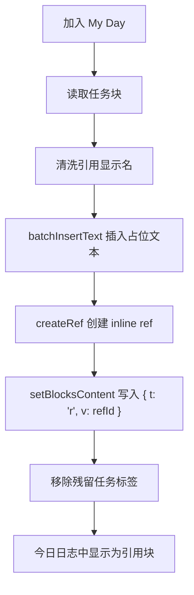

# My Day 引用块实现

## 相关源码

- `src/core/my-day-state.ts`
- `src/ui/task-views-panel.tsx`

## 目标

My Day 同步到今日日志时，不再插入镜像块，而是插入真正的引用块。

最终效果有两点：

1. 今日日志里看到的是一个引用块，而不是镜像块。
2. 引用块只显示任务名称，不把任务标签 `#任务` 一起带进去，避免任务面板把日志条目再次识别成一个独立任务。

## 最终实现



### 1. 生成引用显示名

`resolveTaskReferenceLabel(taskId)` 先读取任务块正文，再从任务块自身的 tag refs 中收集任务标签别名，剥离正文里的 `#标签` 文本，只保留标题部分。

这样做的原因是：如果把完整任务文本直接拿去创建引用 alias，Orca 会把 `#任务` 也当成可见文本处理，日志条目就会变成 `昨天任务 #任务`。

### 2. 创建引用块

`insertTaskReferenceChildBlock(...)` 先用 `core.editor.batchInsertText` 插入一个占位块，再由 `setBlockTaskReferenceContent(...)` 把它改写成引用块。

引用块的关键写法是：

```ts
await orca.commands.invokeEditorCommand(
  "core.editor.setBlocksContent",
  null,
  [
    {
      id: blockId,
      content: [{ t: "r", v: refId }],
    },
  ],
  false,
)
```

其中 `refId` 不是任务 ID 本身，而是先通过 `core.editor.createRef(...)` 创建出来的 inline ref ID。

### 3. 清理残留标签

在把条目转成引用块后，会针对任务块里实际存在的 tag aliases 调用 `core.editor.removeTag`，只清掉任务标签相关的残留文本，不动用户自己写的其它内容。

### 4. 旧数据归一化

`normalizeMyDayJournalEntryReference(...)` 会处理已经存在的 My Day 条目：

- 如果还是旧镜像块，保留兼容。
- 如果已经是引用块，会重新整理 alias。
- 如果条目里残留了任务标签，会一并清掉。

## 兼容边界

1. 旧的 `_repr.type === "mirror"` 条目仍然可识别。
2. My Day 内部标记 `_mlo_task_my_day_task_id` 和 `_mlo_task_my_day_day_key` 仍然是删除和去重依据。
3. 只有 My Day 管理的条目会做这套归一化，不会去改用户手写的普通日志块。

## 相关 API

| API | 用途 |
| --- | --- |
| `core.editor.batchInsertText` | 先创建可定位的占位块。 |
| `core.editor.createRef` | 为任务创建 inline ref。 |
| `core.editor.setBlocksContent` | 把占位块写成引用片段。 |
| `core.editor.setRefAlias` | 归一化已有引用块的显示名。 |
| `core.editor.removeTag` | 清理条目里残留的任务标签。 |

## 结果

现在 My Day 的今日日志条目是“可见的引用块”，但它的显示文本只保留任务名称，因此既满足日志可读性，也不会污染任务面板的任务集合。
