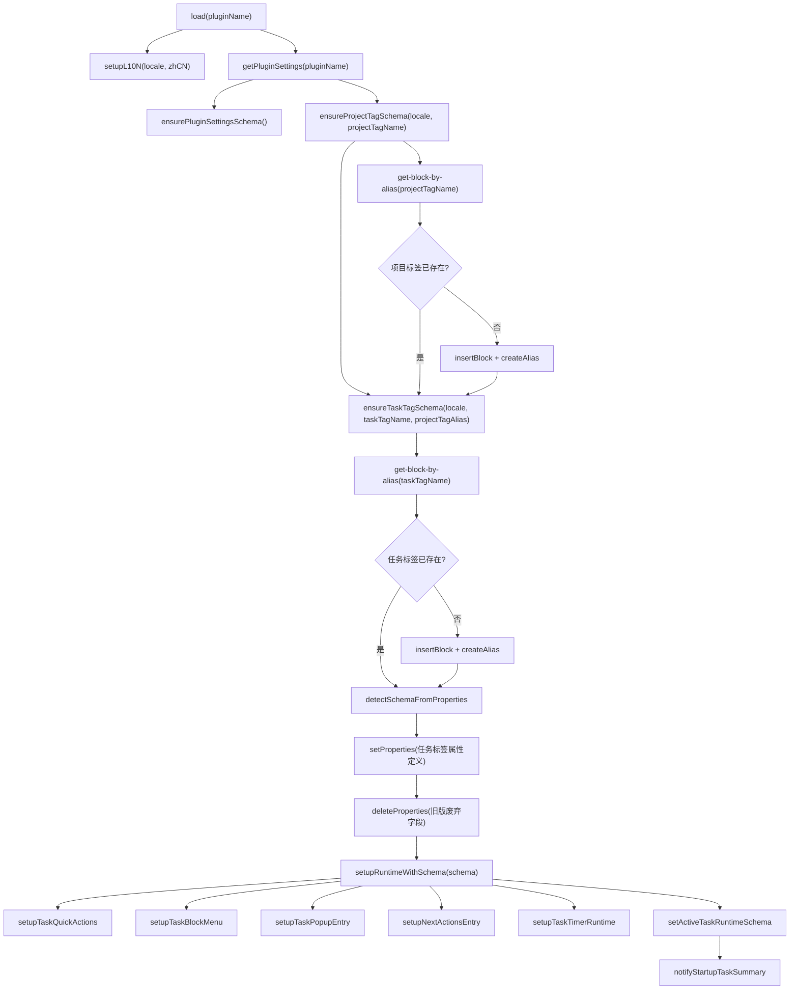
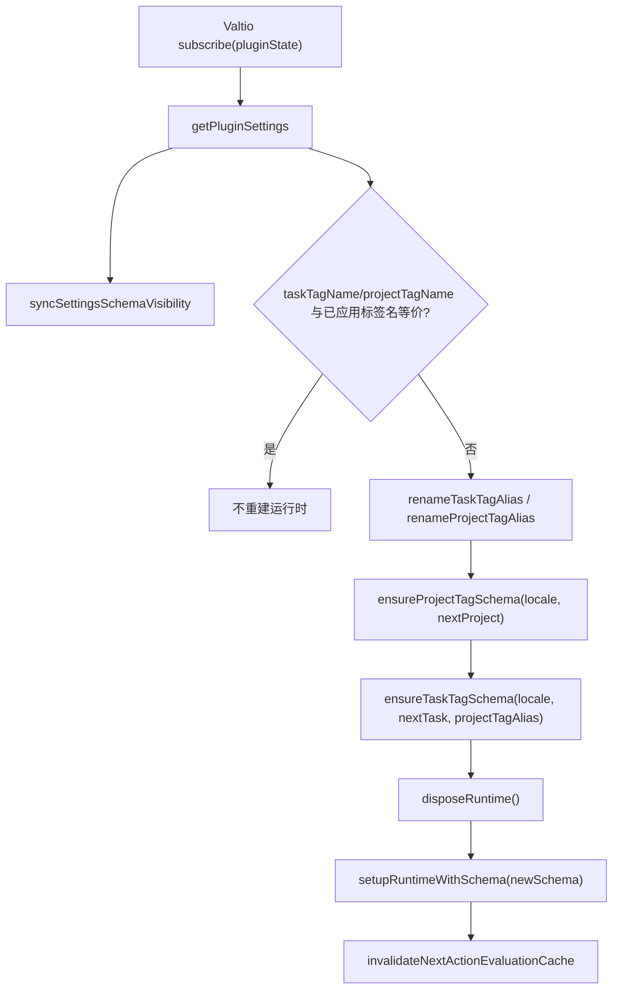
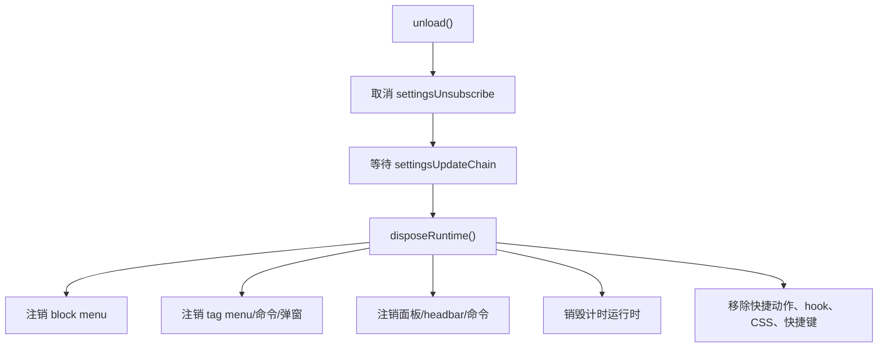

# 01. 运行时启动与注册数据流

## 相关源码

- `src/main.tsx`
- `src/core/plugin-settings.ts`
- `src/core/project-schema.ts`
- `src/core/task-schema.ts`
- `src/core/task-service.ts`
- `src/core/task-block-menu.tsx`
- `src/core/task-popup-entry.ts`
- `src/core/next-actions-entry.ts`
- `src/core/task-timer-runtime.ts`
- `src/core/task-runtime-schema.ts`

## 模块职责

`src/main.tsx` 是插件唯一生命周期入口。它负责把静态源码模块装配到 Orca 运行时：初始化本地化、读取设置、确保项目和任务标签 schema、注册命令/菜单/面板/计时器，并在设置变更或卸载时清理旧注册。

## 启动数据流图

## 注册内容

| 注册函数 | 注册对象 | 数据入口 | 主要输出 |
| --- | --- | --- | --- |
| `setupTaskQuickActions()` | 编辑器命令、快捷键、insertTag hook、状态图标 CSS、body click 监听 | 当前 block、任务标签 ref | 写任务默认值或切换状态 |
| `setupTaskBlockMenu()` | block menu 命令 | 当前 block id | 链接父任务、切换顺序子任务、标记/取消项目 |
| `setupTaskPopupEntry()` | tag menu 命令、普通命令、任务标签 click 捕获 | 任务标签 DOM、命令参数、cursor | 打开任务属性弹窗 |
| `setupNextActionsEntry()` | 任务面板 renderer、打开面板命令、headbar 按钮 | 当前 schema、插件设置 | 渲染 `TaskViewsPanel` |
| `setupTaskTimerRuntime()` | 计时 headbar、计时弹窗、定时刷新、beforeunload | `_mlo_task_timer`、激活任务列表 | 全局计时控制与 checkpoint |
| `setActiveTaskRuntimeSchema()` | 浏览器事件 | 当前 `TaskSchemaDefinition` | 通知 UI schema 已变化 |

## 设置变更数据流

设置变更分两类：

- 功能开关类：如 `myDayEnabled`、`taskTimerEnabled`，会重写设置 schema，使相关设置项可见性和默认值保持同步。
- 任务/项目标签名：会通过 `core.editor.renameAlias` 重命名对应 alias，并重建所有依赖 schema 的运行时能力；项目标签名变化后，任务标签的 `Projects` 字段 scope 也会随新项目标签同步。

## 卸载数据流

## 关键边界

1. 所有注册 ID 使用稳定命名空间 `task-planner.*`，同时清理历史兼容 ID。
2. 运行时注册依赖当前 `TaskSchemaDefinition`，任务标签名变化必须整体重建。
3. `disposeRuntime()` 会先清理 UI 入口，再清理快捷动作，避免热重载后重复注册。
4. `settingsUpdateChain` 串行执行设置变更，避免短时间连续设置导致并发重建。

## Orca API 操作标注

| API/命令 | 触发点 | 标注 |
| --- | --- | --- |
| `orca.invokeBackend("get-block-by-alias", taskTagName)` | `ensureTaskTagSchema()`、任务标签名变更、属性弹窗读取标签属性 | 中：启动关键路径；标签名变更时会重复调用。 |
| `orca.invokeBackend("get-block-by-alias", projectTagName)` | `ensureProjectTagSchema()`、项目标签名变更 | 中：启动关键路径；项目标签名变更时会重复调用。 |
| `core.editor.insertBlock` + `core.editor.createAlias` | 任务标签不存在时初始化标签 block | 中：只在首次初始化或标签缺失时发生。 |
| `core.editor.setProperties` / `deleteProperties` | 写任务标签属性 schema、删除旧版属性 | 中：修改任务标签 block schema，会影响后续所有任务字段解释。 |
| `core.editor.renameAlias` | 设置中修改任务标签名 | 高影响：会改变任务身份入口，随后必须重建运行时并失效缓存。 |
| `orca.plugins.setSettingsSchema()` | 启动和设置可见性变化 | 低到中：设置 schema 写入，不应在高频交互中触发。 |
| `orca.plugins.setSettings("repo", ...)` | 标签重命名失败后的设置回滚 | 中：异常路径，用于保持设置与实际 alias 一致。 |
| `registerCommand/registerEditorCommand/registerPanel/registerHeadbarButton` | 运行时注册 | 低：注册本身通常不耗时，但必须在卸载时注销。 |

当前启动流程没有调用通用 `orca.invokeBackend("query", ...)`。启动摘要会间接调用激活任务计算，进而触发 `get-blocks-with-tags` 全量任务扫描；若任务数量很大，启动通知可能成为启动阶段的主要耗时来源。
