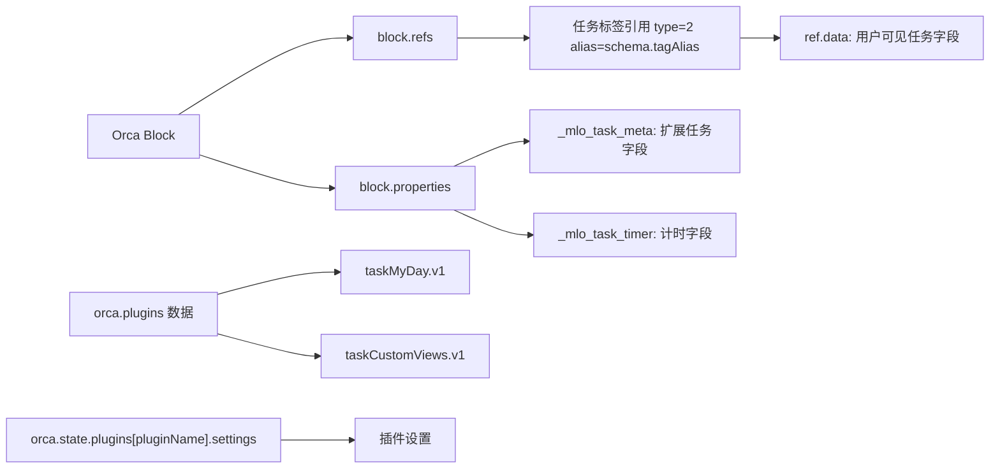
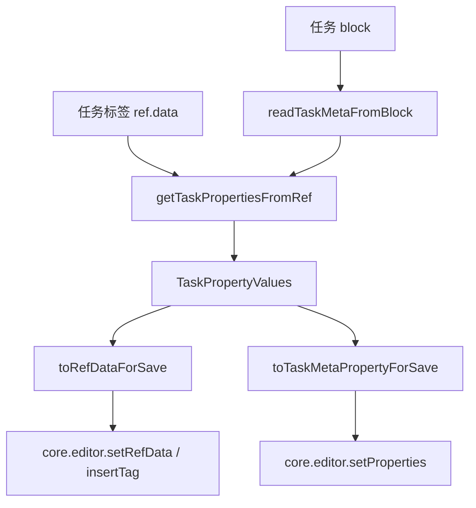
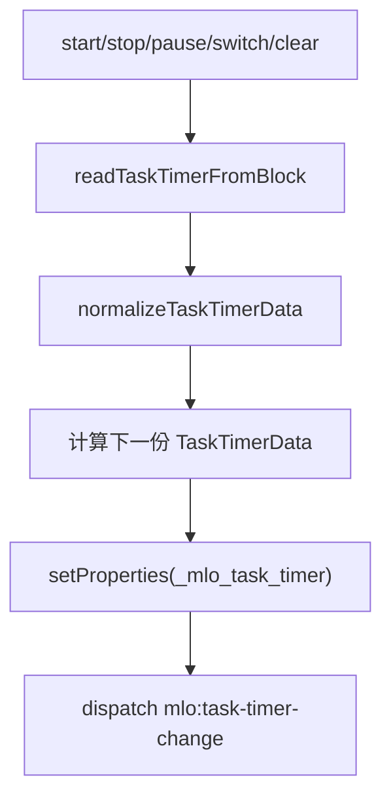

# 02. 数据模型与持久化

## 相关源码

- `src/core/task-schema.ts`
- `src/core/task-properties.ts`
- `src/core/task-meta.ts`
- `src/core/task-timer.ts`
- `src/core/my-day-state.ts`
- `src/core/custom-task-views.ts`
- `src/core/plugin-settings.ts`

## 总体存储图



插件不维护外部数据库。任务主体仍是 Orca block，插件只通过标签引用和 block 属性扩展任务语义。

## 任务标签 schema

默认 alias：`Task`。用户可以通过设置项 `taskTagName` 修改。

中文字段：

| 逻辑字段 | 中文属性名 | 类型 | 存储位置 |
| --- | --- | --- | --- |
| `status` | `状态` | text choices, single | 任务标签 `ref.data` |
| `startTime` | `开始时间` | datetime | 任务标签 `ref.data` |
| `endTime` | `结束时间` | datetime | 任务标签 `ref.data` |
| `dependsOn` | `依赖任务` | block refs | 任务标签 `ref.data` |
| `dependsMode` | `依赖模式` | text choices, single | 任务标签 `ref.data` |
| `dependencyDelay` | `依赖延迟` | number | 任务标签 `ref.data` |
| `star` | `收藏` | boolean | 任务标签 `ref.data` |
| `labels` | `标签` | text choices, multi | 任务标签 `ref.data` |
| `remark` | `备注` | text | 任务标签 `ref.data` |

状态值：

```text
待开始 / 进行中 / 等待中 / 已完成
```

快捷主循环：

```text
待开始 -> 进行中 -> 待开始
```

`等待中` 和 `已完成` 不在快捷主循环内；点击任务状态图标会打开状态选择菜单，可直接选择四种 schema 状态。属性面板和计时联动会识别这些状态。

## `TaskPropertyValues` 聚合模型

`TaskPropertyValues` 定义在 `task-properties.ts`，是 UI 和业务引擎的统一读写模型。



| 聚合字段 | 实际来源 |
| --- | --- |
| `status/startTime/endTime/star/labels/remark/dependsOn/dependsMode/dependencyDelay` | 任务标签 `ref.data` |
| `importance/urgency/effort` | `_mlo_task_meta.priority` |
| `reviewEnabled/reviewType/nextReview/reviewEvery/lastReviewed` | `_mlo_task_meta.review` |
| `repeatRule` | `_mlo_task_meta.recurrence.repeatRule` |

## `_mlo_task_meta`

属性名：`_mlo_task_meta`  
属性类型：JSON，`type = 0`  
schema version：`2`

```ts
{
  schema: 2,
  priority: {
    importance: number | null,
    urgency: number | null,
    effort: number | null,
  },
  review: {
    enabled: boolean,
    type: "single" | "cycle",
    nextReviewAt: number | null,
    reviewEvery: string,
    lastReviewedAt: number | null,
  },
  recurrence: {
    repeatRule: string,
  },
  subtasks: {
    sequential: boolean,
  },
}
```

数据归一化策略：

- 非对象或非法字段会回退到默认值。
- `review.enabled=false` 时，回顾字段会被清空到非启用状态。
- `recurrence.repeatRule` 兼容旧字段 `rule`。
- `subtasks.sequential` 只接受严格 `true`。

## `_mlo_task_timer`

属性名：`_mlo_task_timer`  
属性类型：JSON，`type = 0`  
schema version：`2`



主要字段：

| 字段 | 说明 |
| --- | --- |
| `elapsedMs` | 累计专注时长。 |
| `totalFocusMs` | 总专注时长，兼容旧字段 `focusMs`。 |
| `completedPomodoros` | 已完成番茄数。 |
| `running/startedAt/sessionId` | 当前 session 状态。 |
| `activeMode` | `direct` 或 `pomodoro`。 |
| `activePhase` | `idle/focus/short-break/long-break/paused`。 |
| `phaseDurationMs` | 当前番茄相位目标或剩余时长。 |
| `pausedPhase/pausedRemainingMs` | 暂停恢复需要的信息。 |
| `sessionLog` | 最近 20 条 session 记录。 |

## 插件私有数据

### `taskMyDay.v1`

模块：`my-day-state.ts`

```ts
{
  schema: 1,
  dayKey: "YYYY-MM-DD",
  displayMode: "schedule",
  journalSectionBlockId: DbId | null,
  tasks: MyDayTaskEntry[],
  updatedAt: number,
}
```

`MyDayTaskEntry`：

```ts
{
  taskId: DbId,
  sourceBlockId: DbId | null,
  addedAt: number,
  scheduleStartMinute: number | null,
  scheduleEndMinute: number | null,
  order: number,
  mirrorBlockId: DbId | null,
}
```

### `taskCustomViews.v1`

模块：`custom-task-views.ts`

保存自定义视图数组，每个视图包含名称、创建/更新时间和筛选树。

## 插件设置

模块：`plugin-settings.ts`

设置存在 `orca.state.plugins[pluginName].settings` 中，通过 `orca.plugins.setSettingsSchema()` 定义 schema。

| 设置 | 数据影响 |
| --- | --- |
| `taskTagName` | 任务标签 alias，影响所有任务读取和写入。 |
| `myDayEnabled` | 控制 My Day 功能和设置可见性。 |
| `myDayResetHour` | 影响 `dayKey` 计算与跨日清空。 |
| `dueSoonDays/dueSoonIncludeOverdue` | 即将到期视图过滤窗口。 |
| `startupTaskSummaryNotificationEnabled` | 启动时是否查询任务摘要。 |
| `defaultTaskViewsTab` | 面板首次打开 tab。 |
| `showTaskPanelIcon` | headbar 任务面板按钮。 |
| `showSubtaskProgressBar` | 任务列表子任务进度展示。 |
| `taskTimerEnabled` | 计时器 UI 和行为。 |
| `taskTimerAutoStartOnDoing` | 状态到进行中时自动计时。 |
| `taskTimerMode` | 直接计时或番茄钟。 |

## 自定义任务属性

任务标签 schema 允许用户新增自定义属性。`task-properties.ts` 会：

1. 从任务标签 block 的 properties 中收集 schema 属性。
2. 排除内置字段、旧版保留字段和 `_` 开头字段。
3. 支持 text、number、boolean、datetime、block refs、single/multi text choices。
4. 在属性弹窗中形成 `TaskCustomPropertyDescriptor`。
5. 保存时通过 `buildTaskCustomRefData()` 合并回任务标签 `ref.data`。

## Orca API 操作标注

| 操作类型 | API/命令 | 数据对象 | 耗时/影响标注 |
| --- | --- | --- | --- |
| 设置写入 | `orca.plugins.setSettingsSchema(pluginName, schema)` | 插件设置 schema | 低到中：启动和设置可见性变化时调用，不应高频触发。 |
| 内存读取 | `orca.state.plugins[pluginName].settings` | 插件设置读取 | 低：内存读取。 |
| 插件数据读写 | `orca.plugins.getData/setData(pluginName, "taskMyDay.v1")` | My Day 私有状态 | 低到中：数据小，但会在 My Day 操作队列中多次读写。 |
| 插件数据读写 | `orca.plugins.getData/setData(pluginName, "taskCustomViews.v1")` | 自定义视图配置 | 低：通常为小型 JSON 配置。 |
| 修改/新增标签数据 | `core.editor.setRefData` / `core.editor.insertTag` | 任务标签 `ref.data` | 中：用户可见任务字段主写入路径；批量状态推进时会循环调用。 |
| 修改属性 | `core.editor.setProperties` | `_mlo_task_meta`、`_mlo_task_timer` | 中：扩展字段和计时字段主写入路径；批量计时 checkpoint 或重复任务推进时会循环调用。 |
| 单次查询 | `orca.invokeBackend("get-block-by-alias", tagAlias)` | 任务标签 block schema | 中：用于读取/确保任务标签属性定义。 |

数据模型层本身没有调用通用 `orca.invokeBackend("query", ...)`。如果未来把任务集合读取改为 Orca query API，应在查询视图和依赖评分文档中补充 query 条件、返回规模、触发频率和缓存策略。
