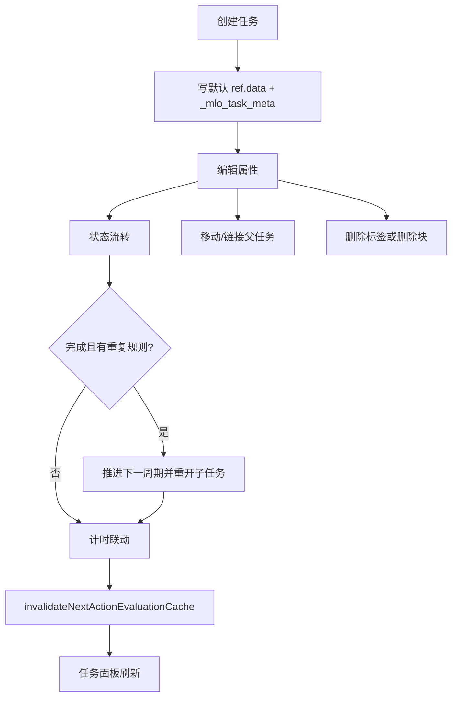
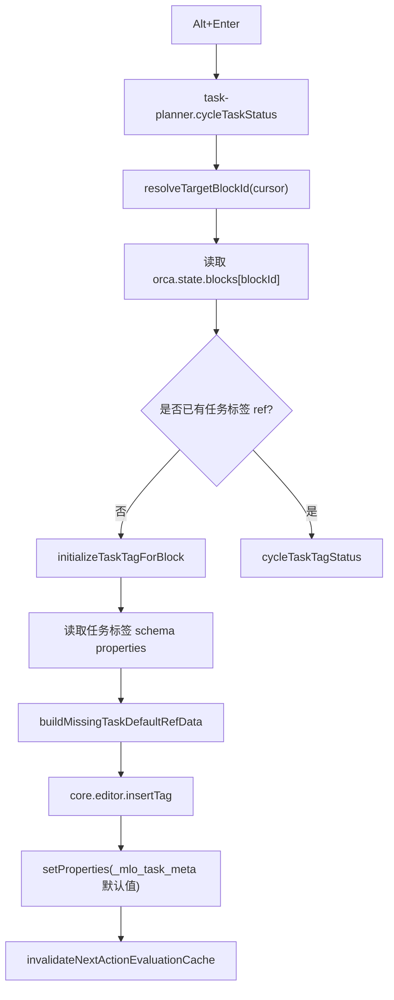
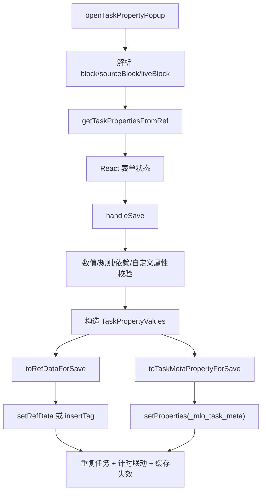
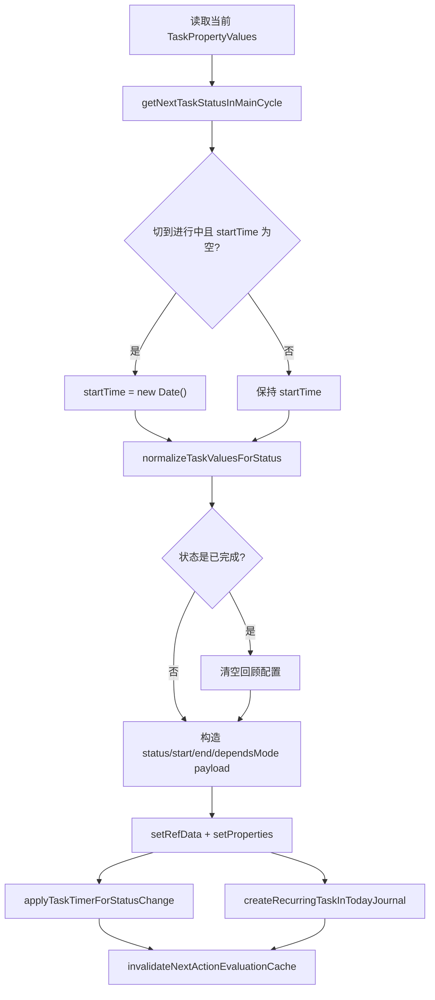
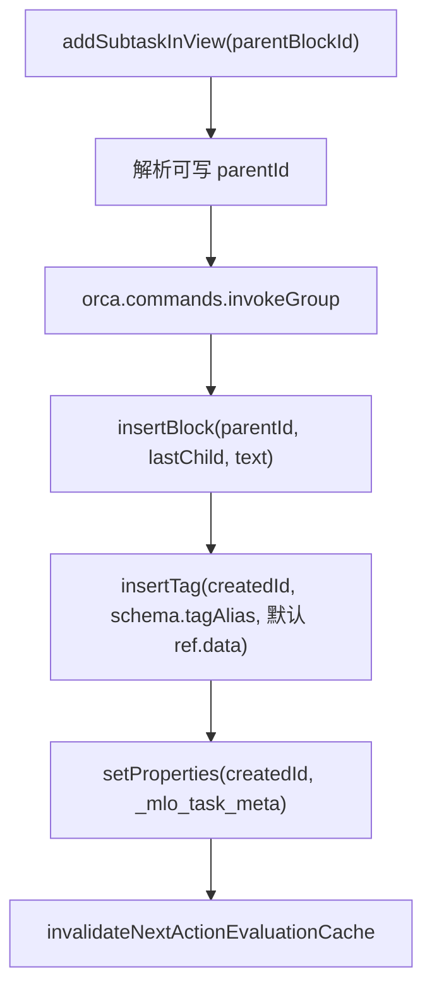
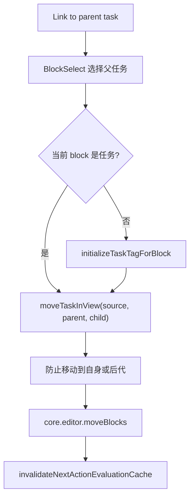
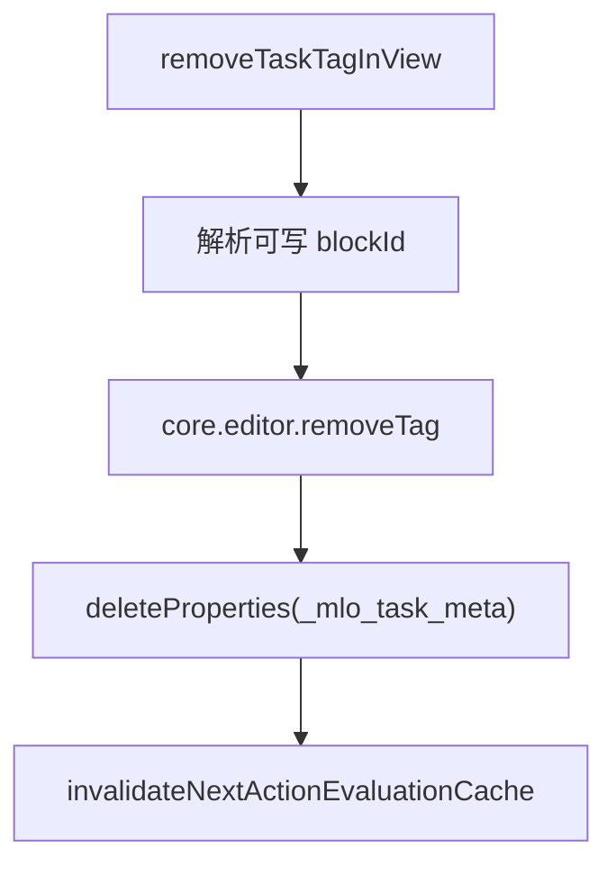
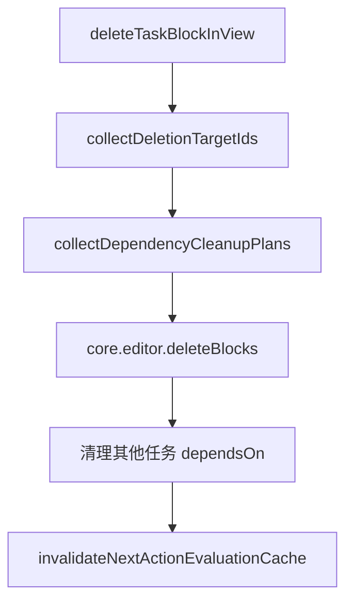

# 03. 任务生命周期数据流

## 相关源码

- `src/core/task-service.ts`
- `src/core/all-tasks-engine.ts`
- `src/core/task-block-menu.tsx`
- `src/ui/task-property-panel.tsx`
- `src/ui/task-views-panel.tsx`
- `src/core/task-properties.ts`
- `src/core/task-recurrence.ts`
- `src/core/task-timer.ts`

## 生命周期总图

## 任务创建

入口包括：

- 编辑器里按 `Alt+Enter`。
- 任务管理面板“新增任务”。
- 属性弹窗的新建任务模式。
- block menu 链接父任务时，若当前 block 不是任务，会自动任务化。

### `Alt+Enter` 创建流

默认任务值：

| 字段 | 默认值 |
| --- | --- |
| `status` | schema 默认状态，中文为 `待开始` |
| `startTime/endTime` | `null` |
| `dependsMode` | `ALL` |
| `importance/urgency/effort` | `50` |
| `review/repeat/labels/remark/dependsOn` | 空 |

## 属性编辑

属性弹窗是最完整的写入入口。

保存要点：

- 用户可见字段写入任务标签 `ref.data`。
- 重要性、紧急度、工作量、回顾、重复、顺序子任务等扩展字段写入 `_mlo_task_meta`。
- 自定义属性会与内置字段一起合并进 `ref.data`。
- 状态变更会触发 `createRecurringTaskInTodayJournal()` 和 `applyTaskTimerForStatusChange()`。

## 状态流转

状态流转有两个主要入口：

- 编辑器命令：`task-service.ts` 的 `cycleTaskTagStatus()`。
- 任务面板：`all-tasks-engine.ts` 的 `cycleTaskStatusInView()`。

状态联动：

- 切到 `进行中`：若开始时间为空则写当前时间；若开启自动计时则启动计时。
- 切到 `已完成`：清空回顾配置；停止计时；若有重复规则则推进到下一周期。
- 切到 `等待中`：停止计时。

## 新增子任务

面板新增子任务使用 `addSubtaskInView()`。

新增子任务保持 Orca block 的真实层级关系，因此依赖引擎会把它识别为父任务的子任务。

## 链接父任务与移动任务

block menu 的“链接到父任务”最终调用 `moveTaskInView()`。

移动任务也用于全部任务树拖拽：

- `before`：移动到目标前。
- `after`：移动到目标后。
- `child`：移动为目标最后一个子块。
- `moveToTodayJournalRoot`：移动到今日日志根块最后。

## 删除任务标签

删除任务标签不删除 block 内容，只移除任务身份和任务扩展属性。

## 删除任务块

删除块前会收集被删任务及其后代任务 ID。删除后会扫描所有任务，把依赖中指向这些任务的引用删掉，避免其他任务永久处于不可解释的依赖阻塞。

## 任务生命周期中的统一写入边界

1. 优先写 `setRefData`，失败时 fallback 到 `insertTag` 并合并旧数据。
2. 所有影响任务可执行性的改动都应调用 `invalidateNextActionEvaluationCache()`。
3. 操作镜像块时，使用 `getMirrorId()`、`getMirrorIdFromBlock()` 和候选 ID 列表寻找可写目标。
4. 涉及多个编辑器操作时使用 `orca.commands.invokeGroup()`，保持撤销历史聚合。

## Orca API 操作标注

| 操作类型 | API/命令 | 使用位置 | 耗时/影响标注 |
| --- | --- | --- | --- |
| 新增 | `core.editor.insertBlock` | 新建任务、子任务、首次创建任务标签 block | 中：会创建真实 block，通常放在 `invokeGroup` 中。 |
| 新增/修改 | `core.editor.insertTag` | 给 block 任务化、`setRefData` fallback | 中：写任务身份和全部/部分 `ref.data`，失败重试时可能发生多次。 |
| 修改 | `core.editor.setRefData` | 状态切换、属性保存、重复任务推进、子任务重开 | 中：任务字段主写入 API。 |
| 修改 | `core.editor.setProperties` | 写 `_mlo_task_meta`、`_mlo_task_timer`、My Day 内部标记 | 中：常与 `setRefData` 成对调用。 |
| 修改/删除属性 | `core.editor.deleteProperties` | 移除任务标签后删除 `_mlo_task_meta`、清理旧 schema 字段 | 中：会改变 block 属性集合。 |
| 删除任务身份 | `core.editor.removeTag` | 删除任务标签 | 高影响：移除任务身份，但保留 block 内容。 |
| 批量删除 | `core.editor.deleteBlocks` | 删除任务块、My Day 镜像清理 | 高影响：会删除文档结构，必须配合依赖清理。 |
| 批量移动 | `core.editor.moveBlocks` | 任务树拖拽、链接父任务、移动到今日日志 | 高影响：改变文档树结构，需防止移动到自身/后代。 |
| 递归补充查询 | `orca.invokeBackend("get-block", id)` | 解析可写候选块、父链、删除目标后代 | 中到高：单次较小，但循环解析树结构时会累积。 |
| 批量查询 | `orca.invokeBackend("get-blocks-with-tags", [tagAlias])` | 删除任务块前收集依赖清理计划 | 高：按任务标签查询全部任务，用于删除后清理其他任务依赖。 |
| 单次查询 | `orca.invokeBackend("get-journal-block", date)` | 移动任务到今日日志根块 | 中：日志解析，避免高频触发。 |

本生命周期模块没有直接调用通用 `query` API。性能风险主要来自删除任务时的全量依赖清理和大量 `get-block` 兜底加载。
