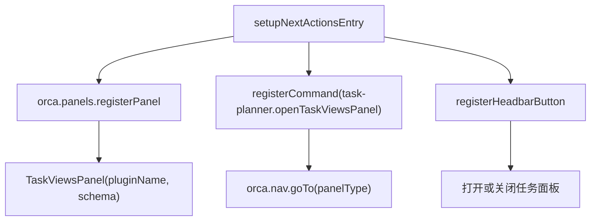
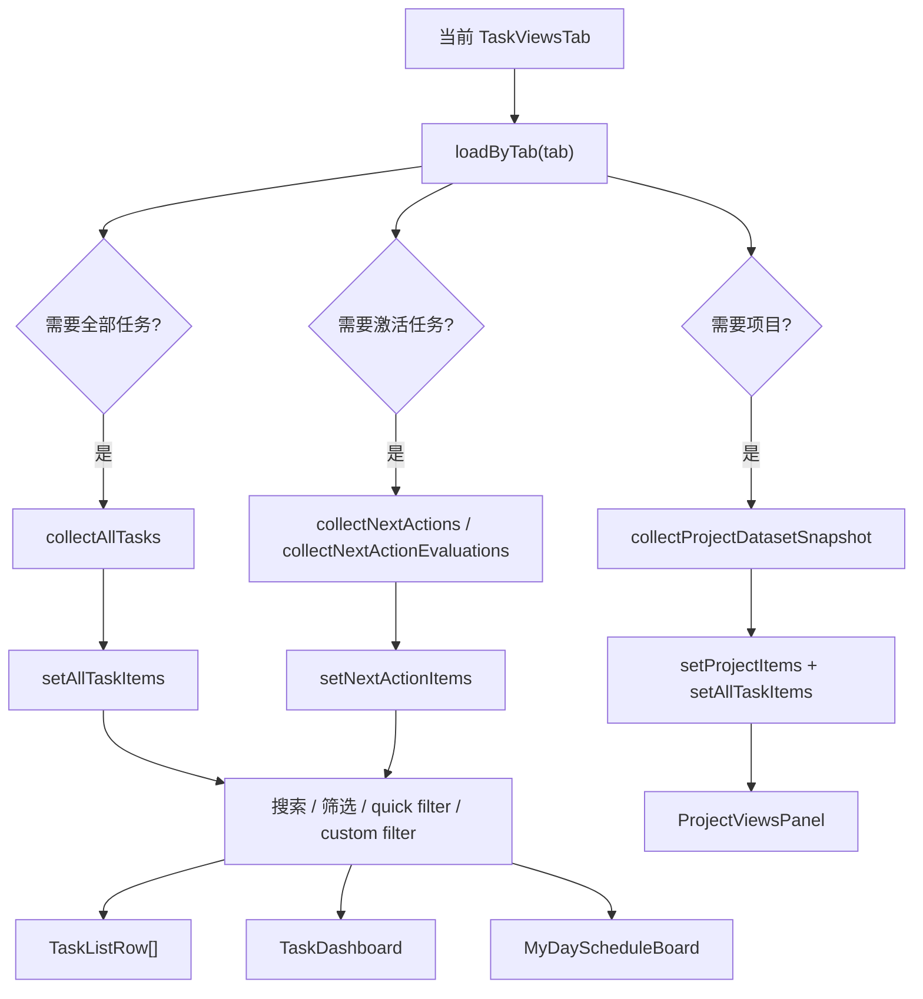
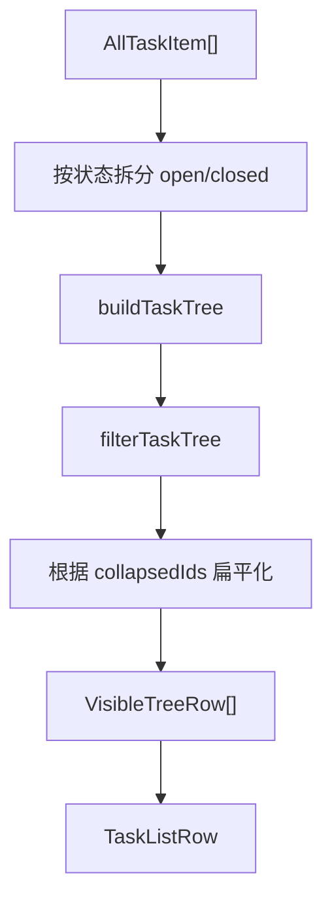
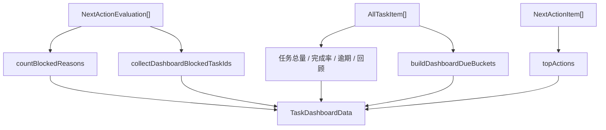
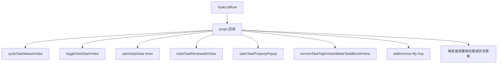
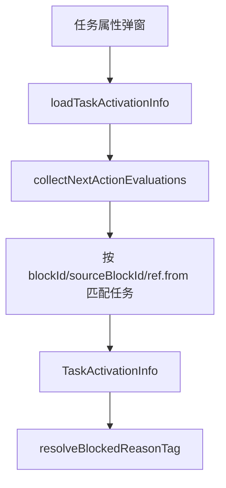

# 04. 查询、视图与任务面板数据流

## 相关源码

- `src/core/all-tasks-engine.ts`
- `src/core/dependency-engine.ts`
- `src/core/project-engine.ts`
- `src/core/next-actions-entry.ts`
- `src/core/task-views-state.ts`
- `src/ui/task-views-panel.tsx`
- `src/ui/project-views-panel.tsx`
- `src/ui/task-list-row.tsx`
- `src/ui/task-dashboard.tsx`
- `src/ui/task-activation-state.ts`

## 面板注册流

`TaskViewsPanel` 是所有任务视图的主容器。它根据当前 tab 决定读取全部任务、激活任务、项目或自定义视图数据。

## 全部任务读取数据流

```mermaid
flowchart TD
  Collect["collectAllTasks(schema)"] --> Query["get-blocks-with-tags(schema.tagAlias)"]
  Query --> RawBlocks["sourceBlock[]"]
  RawBlocks --> PerBlock["逐块解析"]
  PerBlock --> Live["resolve liveBlock / mirrorId"]
  PerBlock --> Ref["findTaskTagRef"]
  Ref --> Values["getTaskPropertiesFromRef"]
  Live --> Text["resolveTaskText"]
  Values --> Review["resolveEffectiveNextReview"]
  PerBlock --> AliasMap["registerTaskAliasIds"]
  AliasMap --> Parent["resolveNearestTaskAncestorId"]
  AliasMap --> Children["collectVisibleChildTaskIds"]
  Parent --> Items["AllTaskItem[]"]
  Children --> Items
```

`collectAllTasks()` 会过滤带有项目标签的 block；项目优先于任务，因此同一 block 同时带 `Task` 和 `Project` 时不会生成 `AllTaskItem`。

`AllTaskItem` 是面板中大多数非激活视图的基础数据：

- block ID 与 source block ID
- parent/children
- 文本、状态、到期、回顾、重复、标签、收藏
- 任务标签 ref
- block properties，用于筛选和自定义字段展示

## tab 与数据源

| tab | 数据源 | 前端处理 |
| --- | --- | --- |
| `dashboard` | `collectAllTasks()` + `collectNextActionEvaluations()` | 聚合指标、阻塞原因、到期桶、高优先任务 |
| `my-day` | `collectAllTasks()` + `loadMyDayState()` | 匹配 My Day taskId、列表/日程渲染 |
| `next-actions` | `collectNextActions()` | 激活任务排序后展示 |
| `projects` | `collectProjectDatasetSnapshot()` | 项目属性、项目列表、进度、统一项目任务列表 |
| `all-tasks` | `collectAllTasks()` | 任务树、开闭任务分组、拖拽 |
| `starred-tasks` | `collectAllTasks()` | `item.star === true` |
| `due-soon` | `collectAllTasks()` | 按设置窗口过滤 `endTime` |
| `review-due` | `collectAllTasks()` | `reviewEnabled && nextReview <= now` |
| `custom:<id>` | `collectAllTasks()` + `loadCustomTaskViews()` | 根据筛选树匹配 |

## 任务管理面板内部数据流

## 全部任务树构建

开闭分组：

- open：未完成、未取消的任务。
- closed：已完成或取消任务。

任务树依赖 `parentId` 和 `children`。如果父任务被筛选掉，面板会尽量保留可见任务的层级上下文或将其提升显示。

## 仪表盘数据流

仪表盘 quick filter：

- `overdue`
- `due-today`
- `blocked`

点击后会切到全部任务视图并应用 quick filter。

## 任务行操作回流

`TaskListRow` 本身不直接读写 Orca 数据，所有变更由 `TaskViewsPanel` 传入回调完成。

项目 tab 由 `ProjectViewsPanel` 渲染：项目列表来自 `ProjectItem[]`，项目详情将结构归属和手动归属去重后展示为统一任务列表，并复用 `TaskListRow` 操作回调。项目属性摘要来自项目标签 `ref.data`，编辑项目时只保存项目状态、开始/截止时间、标签和备注，不改变动态进度口径。添加已有任务时，会把目标项目引用写入任务标签 `ref.data` 的 `Projects` 字段。

## 单任务激活状态

属性弹窗中的激活提示来自 `task-activation-state.ts`。

阻塞原因会按优先级选择主标签，帮助用户理解为什么任务没有进入激活任务。

## Orca API 操作标注

| 操作类型 | API/命令 | 使用场景 | 耗时/影响标注 |
| --- | --- | --- | --- |
| 批量查询 | `orca.invokeBackend("get-blocks-with-tags", [schema.tagAlias])` | `collectAllTasks()` 读取全部任务；多个 tab 共用 | 高：按任务标签返回多条任务，是任务面板主要耗时来源。 |
| 批量查询 | `orca.invokeBackend("get-blocks-with-tags", [projectSchema.tagAlias])` | 项目 tab 读取项目块和项目标签 ref.data | 高：按项目标签返回多条项目数据，项目数量多时会与任务全集扫描叠加。 |
| 递归补充查询 | `orca.invokeBackend("get-block", blockId)` | `collectAllTasks()` 解析父链、缓存缺失 block、镜像块兜底 | 中到高：每个缺失父节点都可能触发一次，深层任务树会放大耗时。 |
| 单次查询 | `orca.invokeBackend("get-block-by-alias", schema.tagAlias)` | 面板加载任务标签属性，用于自定义字段和筛选字段发现 | 中：通常在面板加载/刷新时发生。 |
| 导航 | `orca.nav.goTo()` / `orca.nav.openInLastPanel()` | 打开任务管理面板、导航到任务 block | 低到中：UI 导航操作，不做数据扫描。 |
| 注册 | `orca.panels.registerPanel()` / `orca.headbar.registerHeadbarButton()` | 面板与顶部按钮注册 | 低：生命周期操作。 |

当前查询视图没有使用 `orca.invokeBackend("query", ...)`。所有内置视图和自定义视图都是先通过 `get-blocks-with-tags` 拉取任务全集，再在前端过滤、排序和构建树；因此任务数量越多，`collectAllTasks()` 越需要缓存、节流或避免重复调用。
