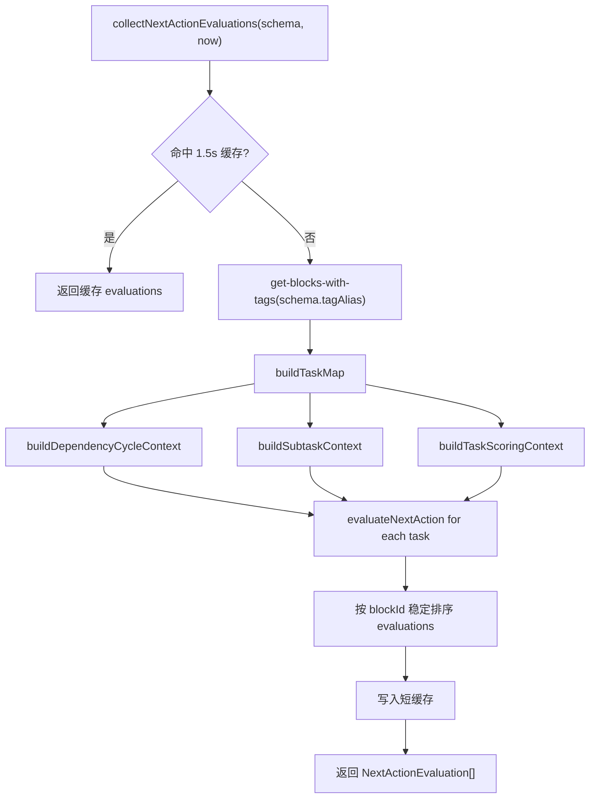
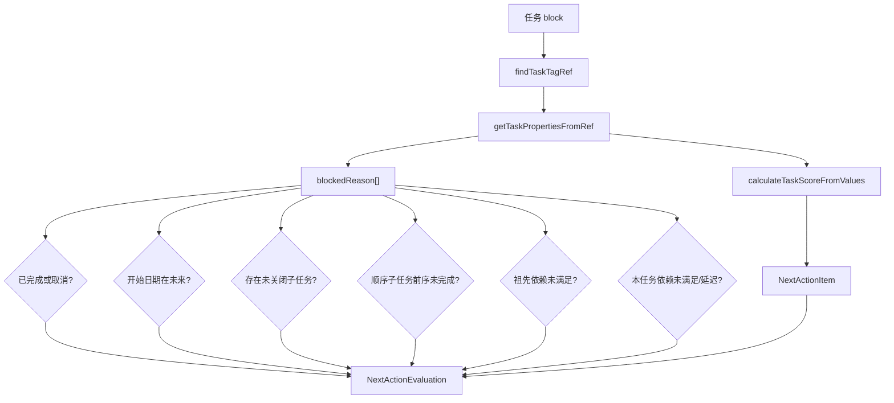
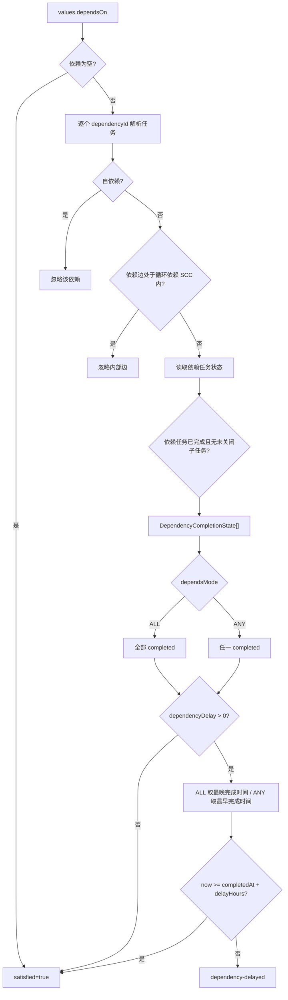
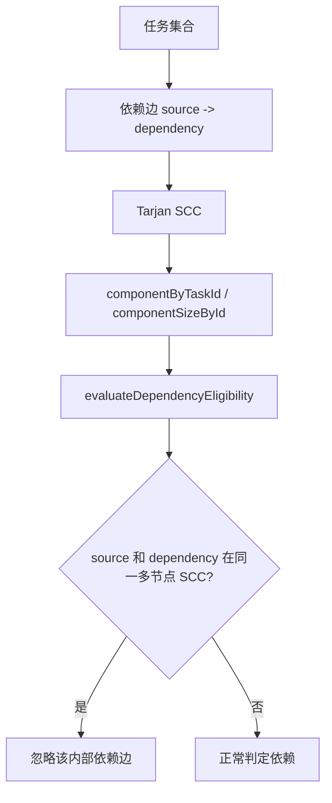
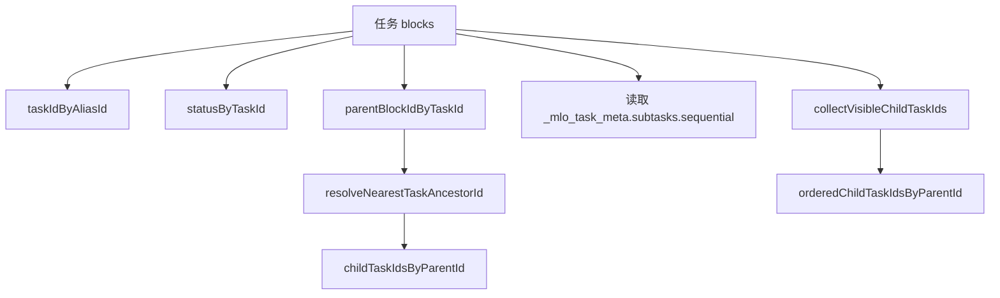
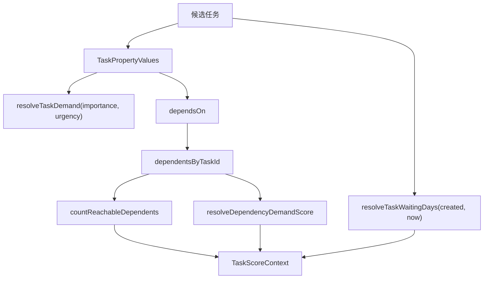
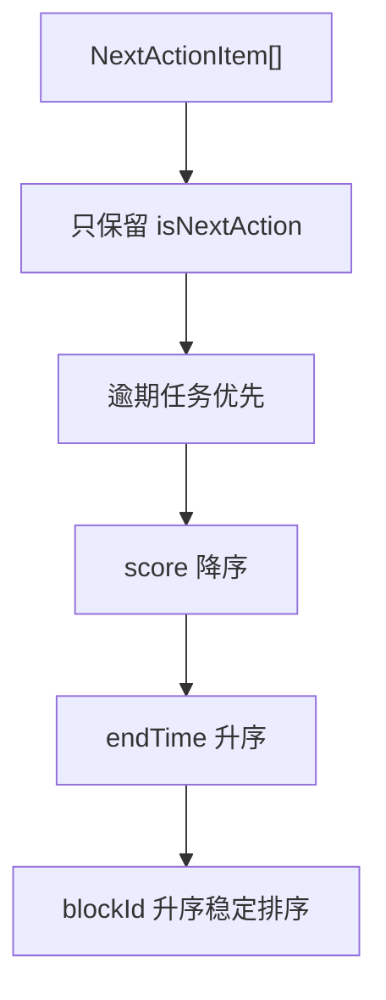

# 05. 依赖、激活任务与评分数据流

## 相关源码

- `src/core/dependency-engine.ts`
- `src/core/score-engine.ts`
- `src/core/task-properties.ts`
- `src/core/task-schema.ts`
- `src/core/task-meta.ts`
- `src/core/task-review.ts`

## 激活任务计算总图



缓存 key 包含任务标签名、是否包含已完成任务以及当前时间 bucket。任何会影响可执行性的写操作都应调用 `invalidateNextActionEvaluationCache()`。

## 单任务判定流



`isNextAction` 规则：

```text
reviewEnabled 为 true -> 强制进入相关任务集合
否则 blockedReason 为空 -> 激活任务
否则 -> 非激活任务
```

## 阻塞原因

| reason | 判定来源 |
| --- | --- |
| `completed` | `isTaskDoneStatus(status, schema)` |
| `canceled` | `isTaskCanceledStatus(status)` |
| `not-started` | `startTime` 所在日期晚于今天 |
| `dependency-unmet` | 依赖任务未达到完成条件 |
| `dependency-delayed` | 依赖已完成但延迟小时数未到 |
| `has-open-children` | 任一后代任务未完成且未取消 |
| `previous-subtask-unfinished` | 父任务开启顺序子任务，当前任务前面的兄弟任务未完成 |
| `ancestor-dependency-unmet` | 任一祖先任务的依赖条件未满足 |

## 依赖判定数据流



依赖 ID 兼容两种形态：

1. 常见情况：`dependsOn` 存的是 block ref ID，通过 `sourceBlock.refs` 找到 `ref.to`。
2. 兼容情况：直接存 block ID，通过 task map 回退解析。

## 循环依赖处理

`buildDependencyCycleContext()` 使用 Tarjan SCC 算法构建强连通分量。



这样可以避免 A 依赖 B、B 依赖 A 导致两者永久死锁。

## 子任务上下文

`buildSubtaskContext()` 负责解析父子任务关系和顺序子任务。



有两类子任务阻塞：

- 父任务自己：如果还有未关闭子任务，父任务不进入激活任务。
- 顺序子任务：如果父任务开启 `sequential`，后序子任务必须等待前序兄弟任务完成。

## 评分上下文

`buildTaskScoringContext()` 计算三个额外评分因素：

- `dependencyDescendants`：该任务被多少下游任务依赖，使用指数归一化。
- `dependencyDemand`：下游任务的重要/紧急需求强度。
- `waitingDays`：任务从创建时间起已存在的天数。



## 评分公式

来自 `score-engine.ts`：

```text
base = 0.40*Importance + 0.22*Urgency + 0.20*Due + 0.10*Start + 0.08*Context
score = base * criticalBoost * deadlineBoost * startByBoost * agingBoost / timePenalty
```

主要因子：

| 因子 | 说明 |
| --- | --- |
| `Importance/Urgency` | 以 50 为中性点做非线性映射。 |
| `Due` | 无截止日为 45；逾期为 100；未来截止按指数衰减。 |
| `Start` | 已到开始时间为 100；未来开始按 14 天窗口衰减。 |
| `Context` | 收藏任务 80，否则 50。 |
| `timePenalty` | 工作量越高，分数越被稀释。 |
| `criticalBoost` | 依赖关键性提升。 |
| `deadlineBoost` | 逾期天数提升。 |
| `startByBoost` | 到期日与工作量共同计算开工压力。 |
| `agingBoost` | 创建时间越久，轻微提升。 |

等待中任务额外乘以 `WAITING_STATUS_MULTIPLIER = 0.6`。

## 激活任务排序



## Orca API 操作标注

| 操作类型 | API/命令 | 使用场景 | 耗时/影响标注 |
| --- | --- | --- | --- |
| 批量查询 | `orca.invokeBackend("get-blocks-with-tags", [tagAlias])` | `collectNextActionEvaluations()` 查询全部任务候选 | 高：激活任务计算的入口，按任务标签返回多条数据。 |
| 递归补充查询 | `orca.invokeBackend("get-block", blockId)` | 构建子任务上下文、解析最近任务祖先、补充 `orca.state` 缺失父节点 | 中到高：任务层级深、父链缺失多时会累积。 |
| 内存读取 | `orca.state.blocks[...]` | 优先读取 live block 和镜像 block | 低：内存读取，优先使用它减少后端调用。 |

当前依赖引擎没有使用通用 `query` API。主要性能保护是 `NEXT_ACTION_CACHE_TTL_MS = 1500` 的短缓存，以及在多个写路径中显式调用 `invalidateNextActionEvaluationCache()`。如果未来把依赖计算下推到 `query`，需要特别标注查询条件、返回上限和是否分页。
