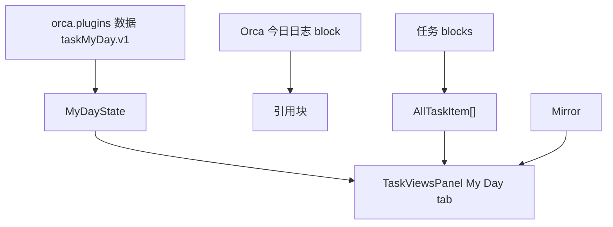
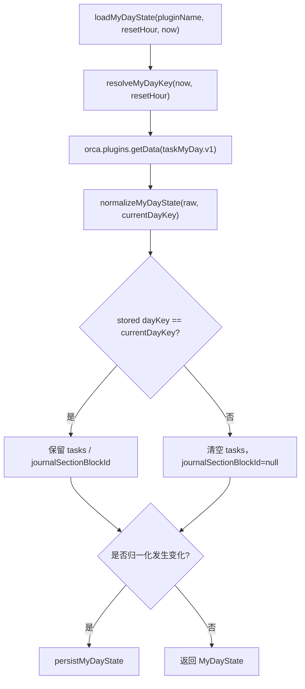
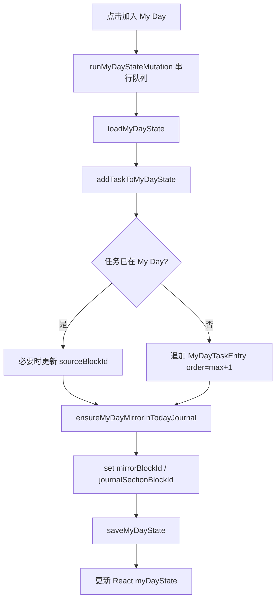
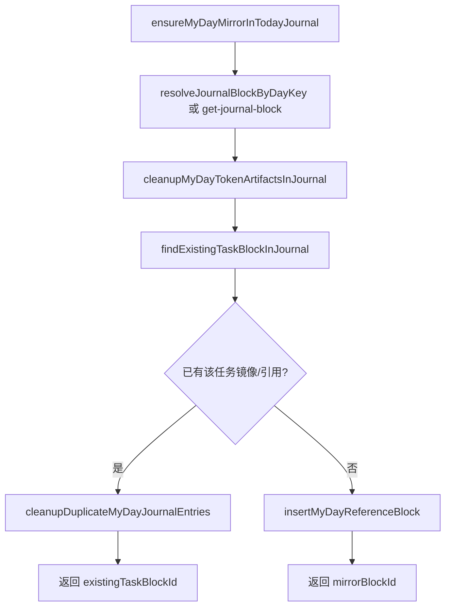
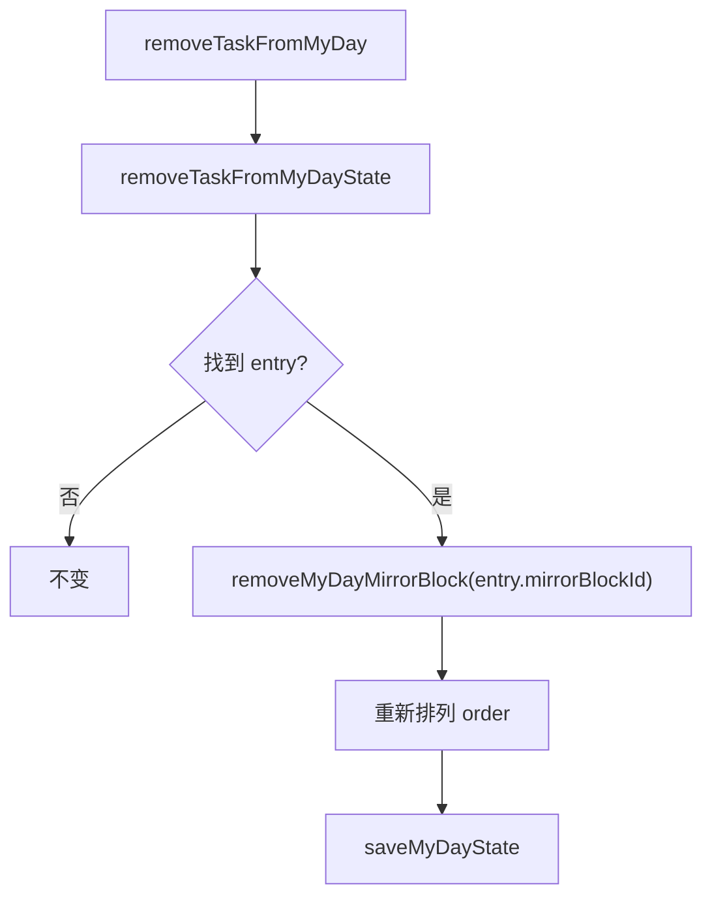
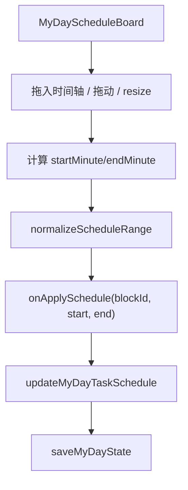
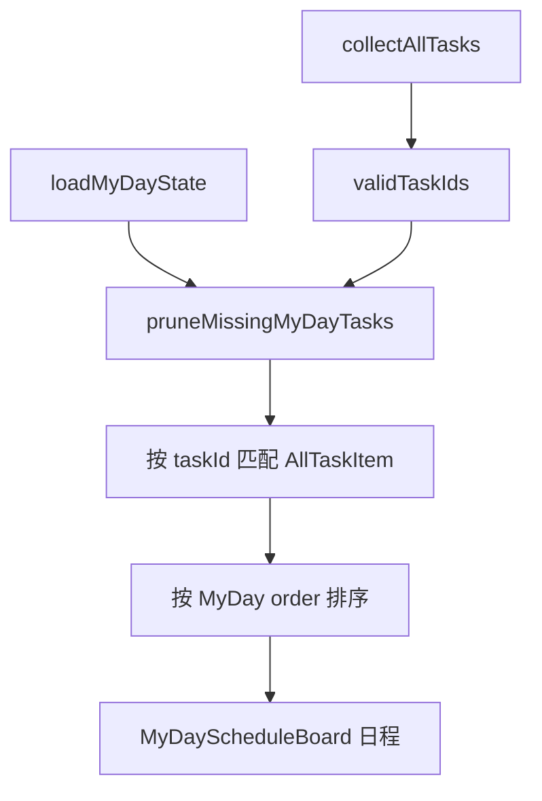

# 06. My Day 数据流

## 相关源码

- `src/core/my-day-state.ts`
- `src/ui/task-views-panel.tsx`
- `src/ui/my-day-schedule-board.tsx`
- `src/core/all-tasks-engine.ts`

## My Day 数据分层



My Day 有两层状态：

1. 插件私有 JSON：记录今天选了哪些任务、顺序、日程分钟数、显示模式、日志条目块 ID。
2. Orca 今日日志：插入指向任务的引用块，让日计划在用户的日志里可见。

## 私有状态结构

```ts
{
  schema: 1,
  dayKey: "YYYY-MM-DD",
  displayMode: "schedule",
  journalSectionBlockId: DbId | null,
  tasks: [{
    taskId: DbId,
    sourceBlockId: DbId | null,
    addedAt: number,
    scheduleStartMinute: number | null,
    scheduleEndMinute: number | null,
    order: number,
    mirrorBlockId: DbId | null,
  }],
  updatedAt: number,
}
```

## dayKey 与跨日重置



`myDayResetHour` 控制“今天”的开始小时。如果当前时间早于 reset hour，会把有效日期回退到前一天。

## 加入 My Day



加入时会归一化 `taskId = getMirrorId(taskId)`，避免同一任务的镜像块或引用块重复加入。

## 今日日志同步



查重方式：

- block 属性标记 `_mlo_task_my_day_task_id`。
- block 属性标记 `_mlo_task_my_day_day_key`。
- 兼容旧数据：`_repr.type === "mirror"` 且 `mirroredId` 指向任务。
- block 内容里存在指向任务的 inline ref。
- block.refs 里存在 inline ref。

引用块显示名来自任务块正文，但会去掉任务块自身的 tag refs 对应的 `#标签` 文本。因此日志中只显示任务名称，不把 `#任务` 这类任务标签复制到 My Day 条目上，避免任务面板把日志引用块再次识别成一个独立任务。归一化已有 My Day 条目时也会重写 inline ref alias，并移除由旧占位插入残留在条目上的任务标签。

## 移出 My Day



删除日志条目块前会确认该 block 有 My Day 内部标记，避免误删用户自己写的普通 block。

## 排期数据流



时间表达：

- 一天用 `0..1440` 分钟表示。
- 支持跨日结束，即 `endMinute <= startMinute` 时按跨日计算 duration。
- duration 约束为 15 分钟到 12 小时。
- UI 拖拽以 15 分钟粒度吸附。

## My Day tab 渲染流



任务完成快照：

- 面板会记录 My Day 任务完成状态快照。
- 当任务完成状态变化时，用于更新 My Day 完成集合和刷新显示。

## 关键边界

1. My Day 状态变更通过 `myDayMutationChainRef` 串行化，避免快速点击导致状态覆盖。
2. `taskMyDay.v1` 是当前日计划的权威列表，今日日志镜像只是可见投影。
3. 今日日志同步必须查重并清理重复项，避免同一个任务被多次插入。
4. 移除任务时只删除带内部标记的镜像/引用块，保护用户手写内容。

## Orca API 操作标注

| 操作类型 | API/命令 | 使用场景 | 耗时/影响标注 |
| --- | --- | --- | --- |
| 插件数据读写 | `orca.plugins.getData/setData(pluginName, "taskMyDay.v1")` | 加载/保存 My Day 私有状态 | 低到中：数据量小，但在串行 mutation 队列中较频繁。 |
| 单次查询 | `orca.invokeBackend("get-journal-block", date)` | 定位今天或指定 `dayKey` 的日志 block | 中：日志解析 API，加入 My Day 和同步时会调用。 |
| 递归补充查询 | `orca.invokeBackend("get-block", blockId)` | 遍历今日日志树、查找镜像/引用、解析插入结果 | 中到高：递归扫描日志子树时可能多次调用。 |
| 新增 | `core.editor.batchInsertText` | 插入 My Day 日志条目占位块 | 中：写文档结构；批量加入 My Day 时会重复发生。 |
| 修改 | `core.editor.setBlocksContent` | 写入 `{ t: "r", v: refId }` 引用片段、清理插入 token | 中：修改 block 内容。 |
| 新增引用 | `core.editor.createRef` | 创建 inline ref，并把返回的 refId 作为引用片段值 | 中：修改引用关系。 |
| 批量删除 | `core.editor.deleteBlocks` | 移除 My Day 镜像/重复项 | 高影响：删除文档结构，但代码会先确认内部标记。 |
| 移动 | `core.editor.moveBlocks` | 兜底创建 detached block 后移动到日志 | 高影响：改变文档结构。 |

My Day 模块没有使用通用 `query` API。主要耗时点是今日日志树的递归查重和 `get-block` 兜底加载；如果日志很大，同步引用块会比单纯保存 `taskMyDay.v1` 更耗时。
