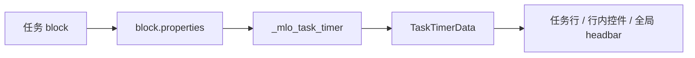
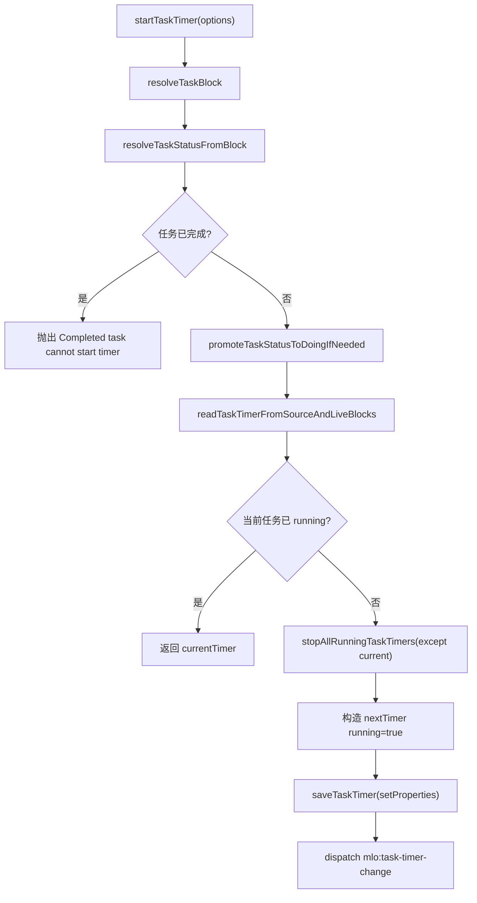
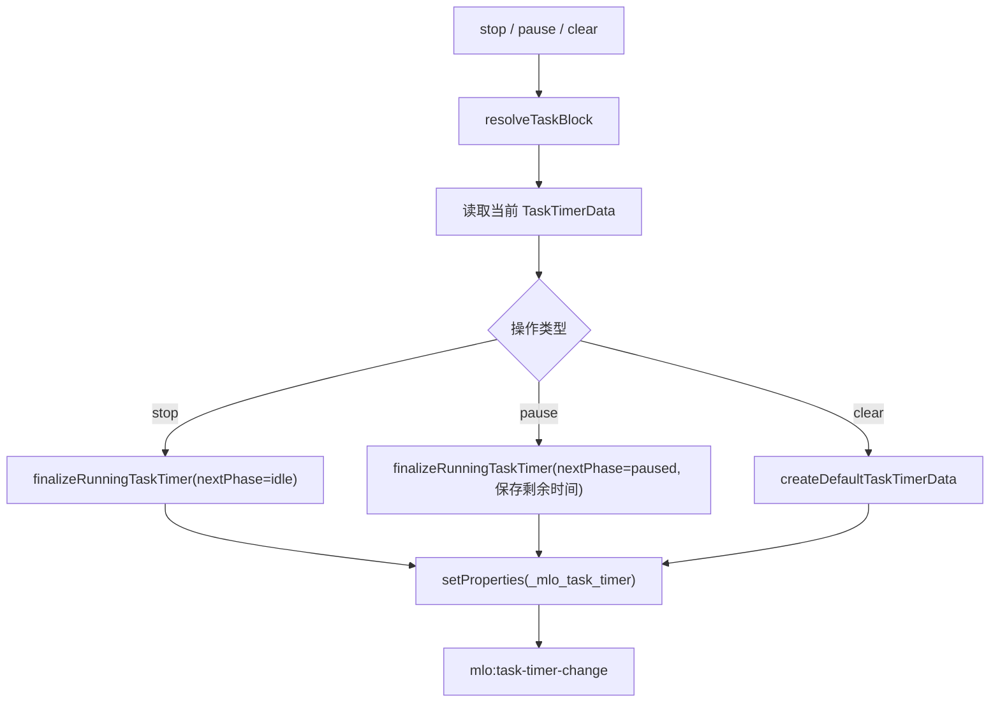
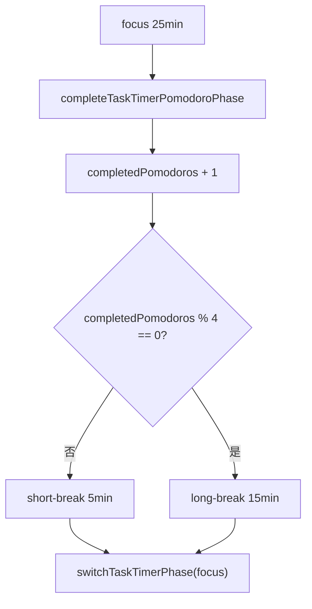
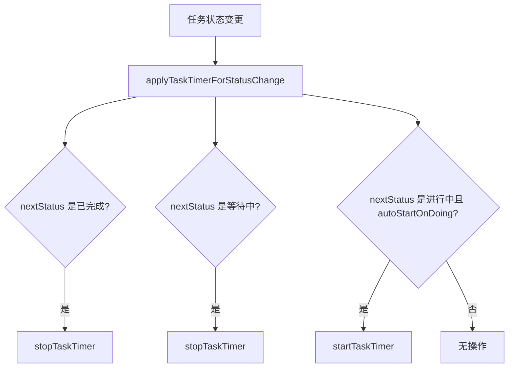
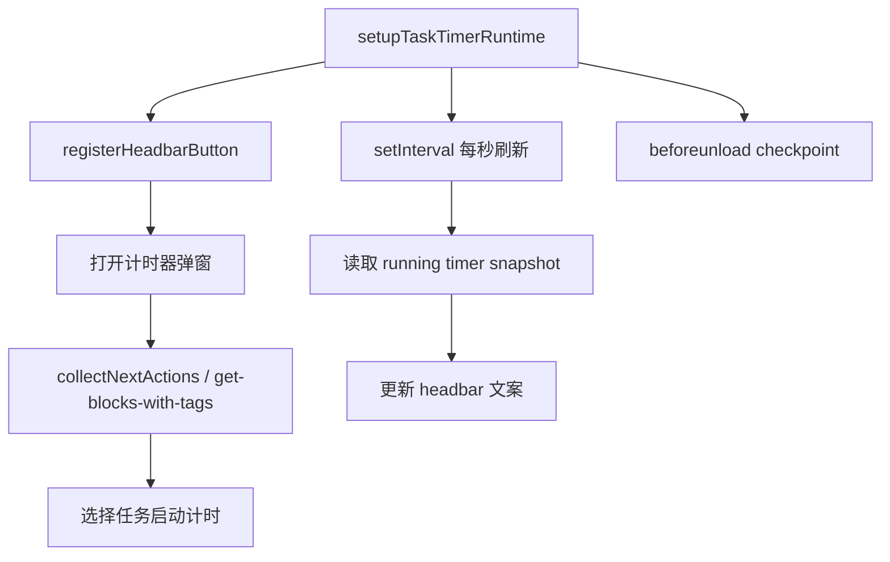
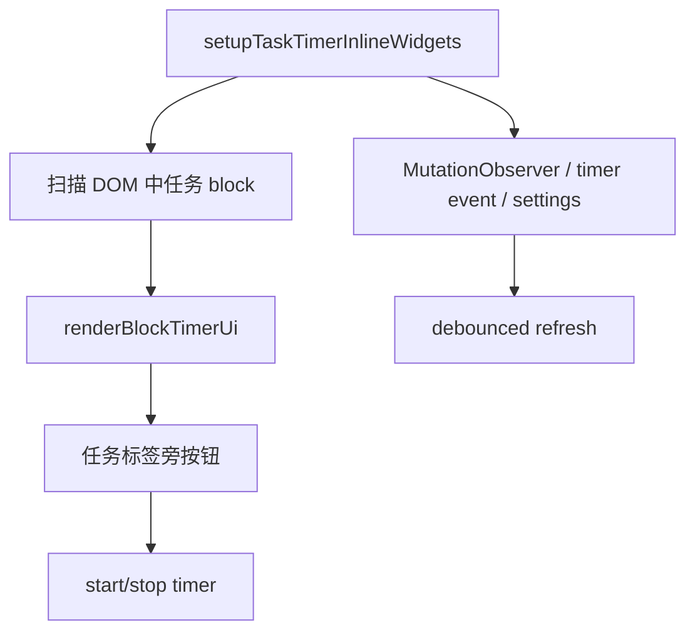
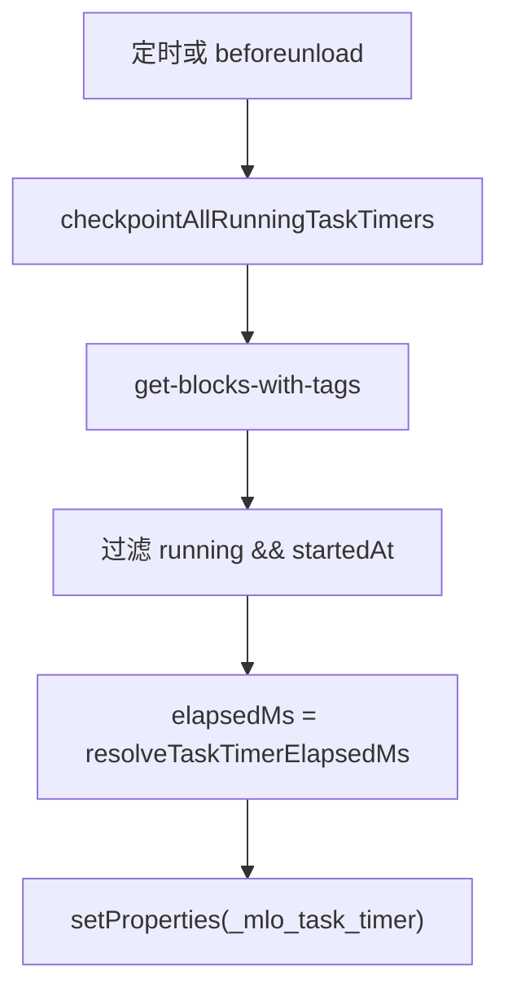

# 07. 任务计时器数据流

## 相关源码

- `src/core/task-timer.ts`
- `src/core/task-timer-runtime.ts`
- `src/core/task-timer-inline.ts`
- `src/ui/task-list-row.tsx`
- `src/ui/task-views-panel.tsx`
- `src/core/plugin-settings.ts`

## 计时数据模型

计时数据保存在任务 block 的 `_mlo_task_timer` JSON 属性中。

核心字段：

- `elapsedMs`
- `totalFocusMs`
- `completedPomodoros`
- `running`
- `startedAt`
- `sessionId`
- `activeMode`
- `activePhase`
- `phaseDurationMs`
- `pausedPhase`
- `pausedRemainingMs`
- `sessionLog`

## 启动计时

启动计时时，如果任务状态是待开始或等待中，会自动提升为进行中；如果没有开始时间，会写入当前时间。

全局策略：同一时间只允许一个任务运行计时。启动新任务会停止其他运行中任务。

## 停止、暂停与清空

`finalizeRunningTaskTimer()` 会：

- 计算从 `startedAt` 到 now 的 session 时长。
- 如果相位是 `focus`，累加到 `elapsedMs/totalFocusMs`。
- 写入 `sessionLog`，最多保留最近 20 条。
- 按参数决定下一相位。

## 番茄钟相位流

默认时长：

| 相位 | 时长 |
| --- | --- |
| `focus` | 25 分钟 |
| `short-break` | 5 分钟 |
| `long-break` | 15 分钟 |

## 状态变更联动

设置项：

- `taskTimerEnabled`：控制计时 UI 和自动计时是否启用。
- `taskTimerAutoStartOnDoing`：切到进行中时是否自动启动计时。
- `taskTimerMode`：默认直接计时或番茄钟。

## 全局运行时

`task-timer-runtime.ts` 注册 headbar 按钮和全局弹窗。

候选任务来源：

1. 优先加载激活任务 `collectNextActions()`。
2. 必要时从全部任务中补充可计时任务。

## 行内控件

`task-timer-inline.ts` 在可见任务 block 上插入轻量计时按钮和详情。

行内控件会检查：

- block 是否存在任务标签 ref。
- 当前设置是否启用计时器。
- 任务是否已完成。
- 当前任务是否有计时记录。

## checkpoint 流

checkpoint 保证长时间运行或页面关闭前，已经发生的时长尽量持久化。

## Orca API 操作标注

| 操作类型 | API/命令 | 使用场景 | 耗时/影响标注 |
| --- | --- | --- | --- |
| 批量查询 | `orca.invokeBackend("get-blocks-with-tags", [schema.tagAlias])` | `stopAllRunningTaskTimers()`、`checkpointAllRunningTaskTimers()`、计时任务候选加载 | 高：按任务标签返回多条任务；启动新计时、beforeunload checkpoint 时尤其要留意。 |
| 补充查询 | `orca.invokeBackend("get-block", blockId)` | `resolveTaskBlock()`、解析可写目标 | 中：候选 ID 兜底加载。 |
| 批量修改 | `core.editor.setProperties` | 保存 `_mlo_task_timer`、状态提升时写任务属性 | 中到高：单次写入不大，但 checkpoint 会循环写多个 running 任务。 |
| 修改 | `core.editor.setRefData` / `insertTag` | 启动计时时把待开始/等待中提升为进行中 | 中：只在状态需要提升时发生。 |
| 间接批量查询 | `collectNextActions()` 间接 `get-blocks-with-tags` | 全局计时弹窗加载候选任务 | 高：候选任务优先来自激活任务计算。 |

计时模块没有直接使用通用 `query` API。性能上最需要注意的是“启动一个任务计时会停止其他 running 任务”，这会触发全量任务扫描；beforeunload checkpoint 也会扫描所有任务寻找 running timer。
