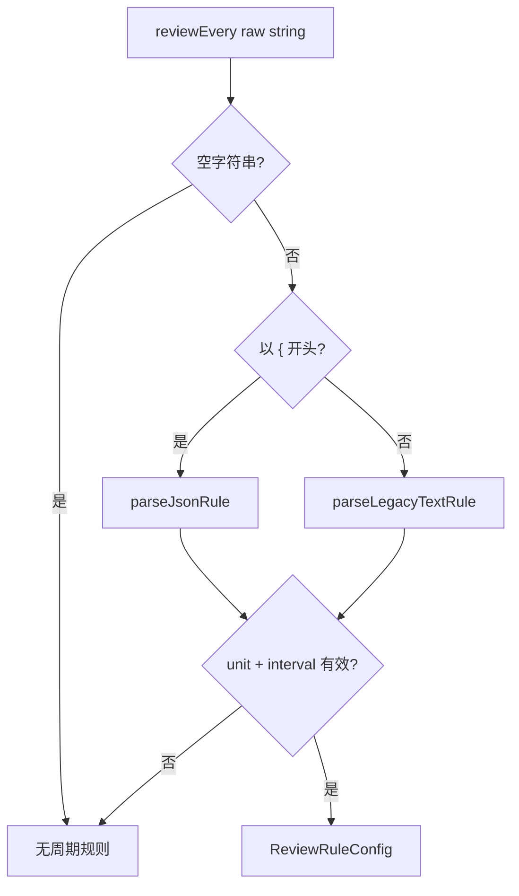
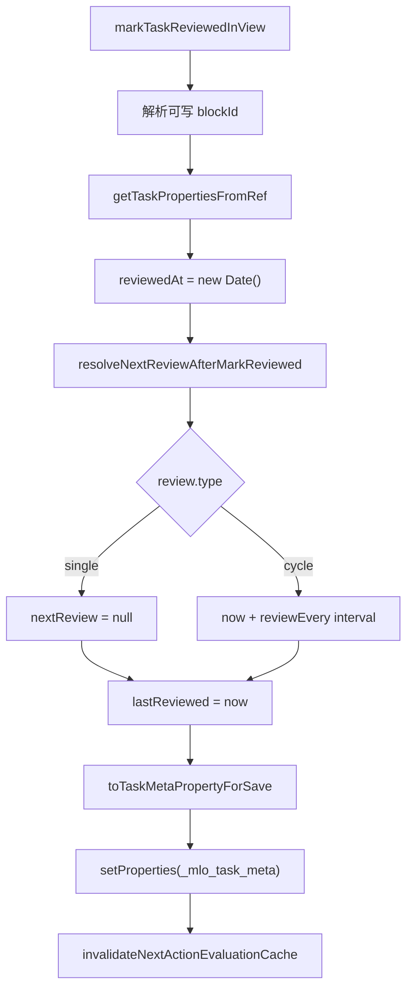
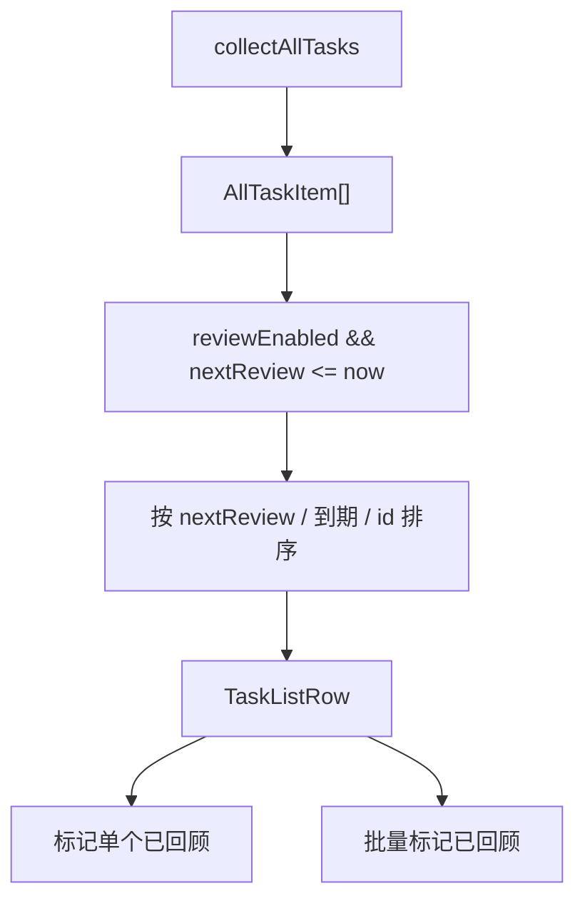
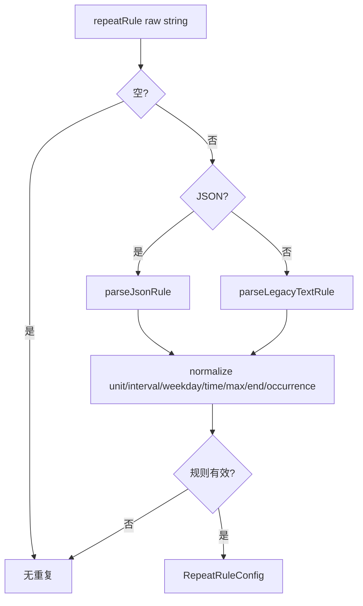
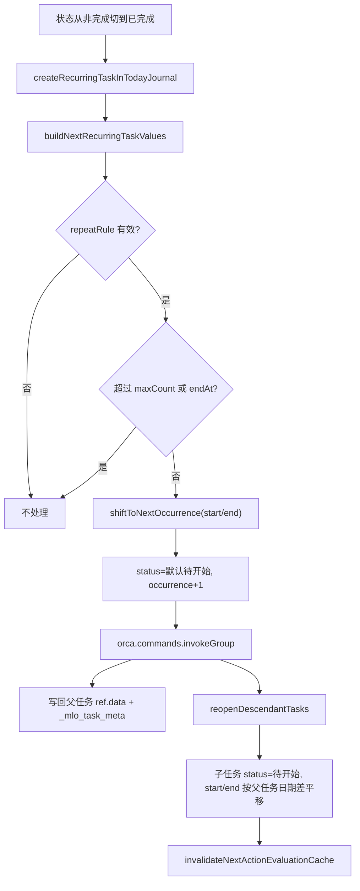
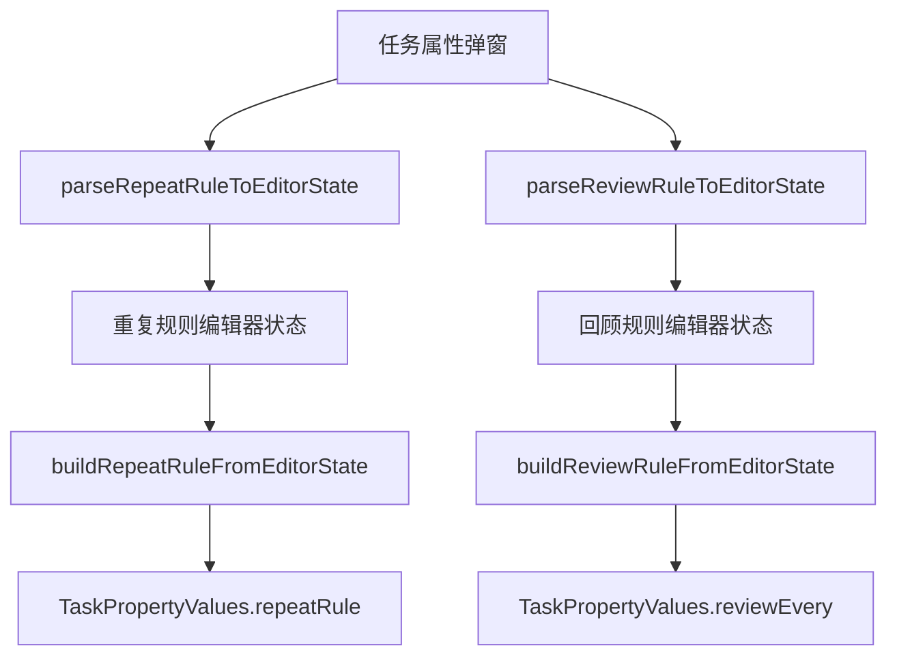

# 08. 回顾与重复任务数据流

## 相关源码

- `src/core/task-review.ts`
- `src/core/task-repeat.ts`
- `src/core/task-recurrence.ts`
- `src/core/all-tasks-engine.ts`
- `src/core/task-service.ts`
- `src/ui/task-property-panel.tsx`
- `src/ui/repeat-rule-editor.ts`

## 回顾数据位置

回顾字段保存在 `_mlo_task_meta.review` 中：

```ts
{
  enabled: boolean,
  type: "single" | "cycle",
  nextReviewAt: number | null,
  reviewEvery: string,
  lastReviewedAt: number | null,
}
```

`reviewEvery` 是规则字符串，当前推荐 JSON 格式，也兼容旧文本规则。

## 回顾规则解析



支持单位：

- `day`
- `week`
- `month`

兼容旧文本：

- `daily`
- `weekly`
- `monthly`
- `every 3 days`
- `3d`

## 标记已回顾



有效下次回顾时间由 `resolveEffectiveNextReview()` 决定：

1. 如果 `nextReview` 有效，直接使用。
2. 如果是周期回顾且有 `lastReviewed`，用 `lastReviewed + reviewEvery` 推导。
3. 否则无待回顾时间。

## 回顾视图数据流



`TaskViewsPanel` 在回顾 tab 中维护 `selectedReviewIds`，用于批量操作。

## 重复任务数据位置

重复规则保存在 `_mlo_task_meta.recurrence.repeatRule` 中。

```ts
{
  unit: "day" | "week" | "month",
  interval: number,
  weekday: number | null,
  hour: number | null,
  minute: number | null,
  maxCount: number | null,
  endAtMs: number | null,
  occurrence: number,
}
```

## 重复规则解析



兼容格式包括：

- JSON：`{"unit":"week","interval":1,"weekday":1}`
- 英文旧文本：`daily`、`weekly`、`every 2 days`、`every monday 09:00`
- 中文旧文本：`每天`、`每周`、`每月`、`每周一 09:00`

## 完成后推进下一周期



当前实现是“推进原任务”，不是复制新任务：

- 原任务完成后，如果重复规则有效，会把同一个任务重置到下一周期。
- 子任务会重新打开，并按父任务日期变化平移。
- `occurrence` 增加，用于 `maxCount` 限制。

## 日期推进规则

| unit | 推进方式 |
| --- | --- |
| `day` | 按 `interval * 1 天` 推进到 now 之后。 |
| `week` | 按 `interval * 7 天` 推进；如果指定 weekday，则寻找下一个匹配星期。 |
| `month` | 按月份推进，保留原始日号，遇到短月取该月最后一天。 |

如果规则指定 `hour/minute`，推进后的日期会应用指定时间。

## UI 编辑流



属性弹窗保存时会把编辑器状态重新序列化为规则字符串，然后写入 `_mlo_task_meta`。

## 关键边界

1. 已完成任务会清空回顾配置，这是 `normalizeTaskValuesForStatus()` 的行为。
2. 重复任务只在状态从非完成进入完成时触发，已完成任务再次保存不会重复推进。
3. `maxCount` 以当前 `occurrence` 判断，达到上限就停止推进。
4. `endAt` 对下一次候选时间生效，候选超过结束时间则停止推进。

## Orca API 操作标注

| 操作类型 | API/命令 | 使用场景 | 耗时/影响标注 |
| --- | --- | --- | --- |
| 修改 | `core.editor.setProperties` | 标记已回顾、保存 `_mlo_task_meta.review/recurrence` | 中：回顾与重复规则主写入。 |
| 批量修改 | `core.editor.setRefData` / `insertTag` | 重复任务推进父任务和后代任务状态/时间 | 中到高：有大量后代任务时会多次写入。 |
| 递归补充查询 | `orca.invokeBackend("get-block", blockId)` | `task-recurrence.ts` 收集后代任务、读取缺失 block | 中到高：重复任务有深层子树时会累积。 |
| 批量编辑事务 | `orca.commands.invokeGroup()` | 重复任务推进父任务与子任务 | 高影响：把多次编辑合成一次撤销单元，但仍会批量修改任务数据。 |

回顾/重复模块没有直接使用通用 `query` API。重复任务完成后的主要耗时来自遍历后代任务和批量写回状态、开始时间、结束时间。
