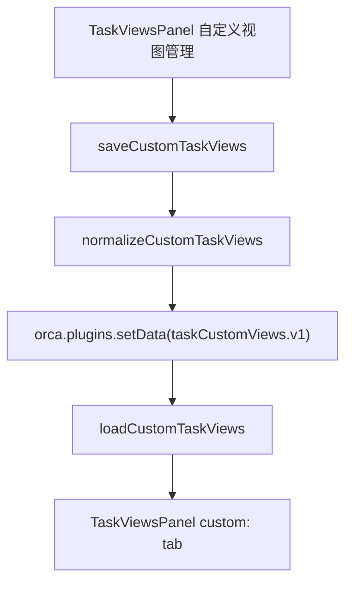
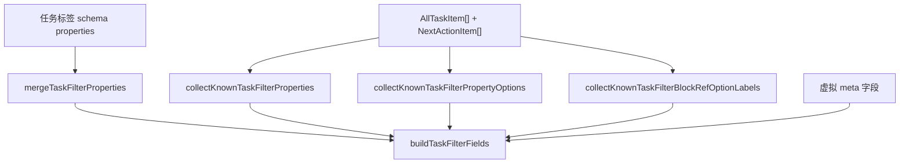
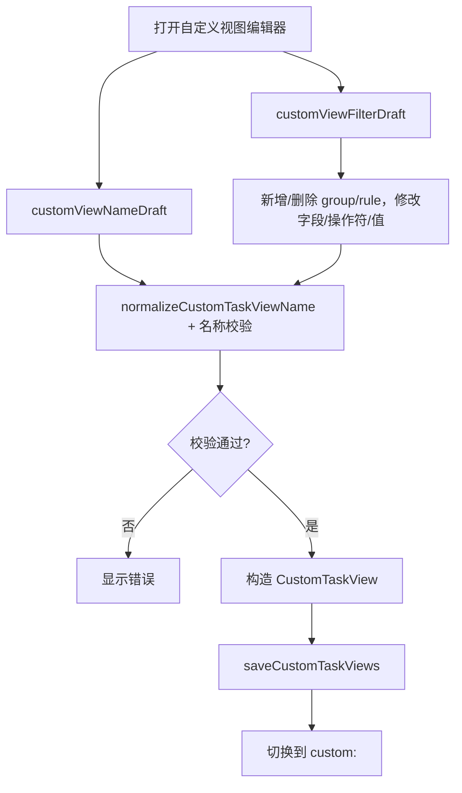
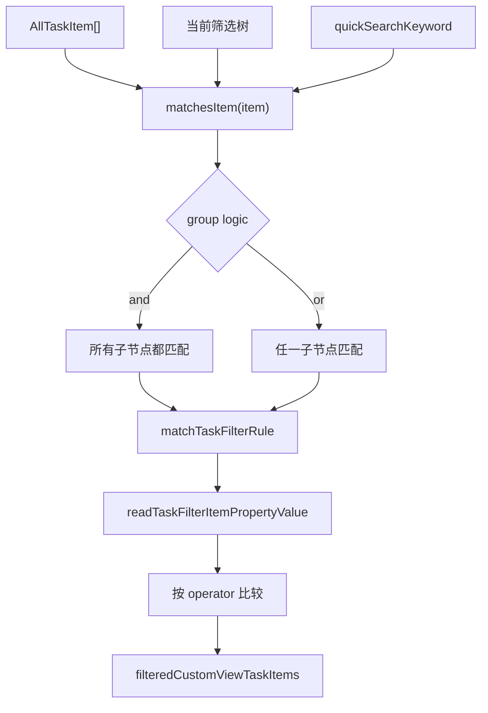
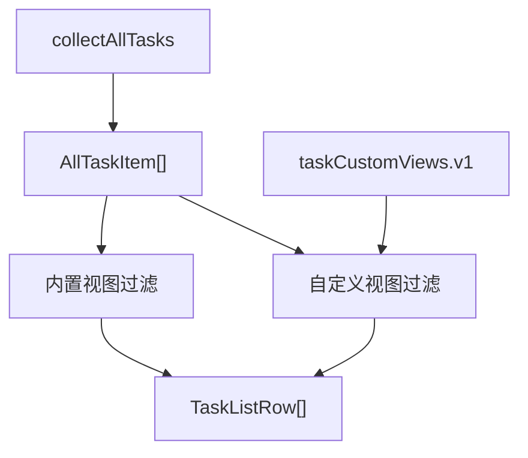

# 09. 自定义视图与筛选数据流

## 相关源码

- `src/core/custom-task-views.ts`
- `src/ui/task-views-panel.tsx`
- `src/core/all-tasks-engine.ts`
- `src/core/task-properties.ts`

## 自定义视图存储

自定义视图保存在插件私有数据 `taskCustomViews.v1`。



数据结构：

```ts
{
  id: string,
  name: string,
  filter: CustomTaskViewFilterGroupNode,
  createdAt: number,
  updatedAt: number,
}
```

## 筛选树

```ts
type CustomTaskViewFilterNode =
  | {
      id: string,
      kind: "rule",
      fieldKey: string,
      operator: CustomTaskViewFilterOperator,
      value: string | string[],
    }
  | {
      id: string,
      kind: "group",
      logic: "and" | "or",
      children: CustomTaskViewFilterNode[],
    }
```

支持 operator：

- `eq`
- `neq`
- `contains`
- `contains-any`
- `contains-all`
- `not-contains`
- `gt`
- `gte`
- `lt`
- `lte`
- `between`
- `before`
- `after`
- `empty`
- `not-empty`

## 字段发现数据流



筛选字段来源：

1. 任务名虚拟字段 `__task_name__`。
2. 任务标签 schema 中定义的属性。
3. 已有任务 block properties 中发现的属性。
4. 插件虚拟 meta 字段，例如重要性、紧急度、工作量、回顾规则、重复规则等。
5. block refs 字段的显示标签由已知任务名映射补全。

## 自定义视图创建/编辑流



## 筛选匹配流



属性读取顺序：

1. 任务名字段从 `item.text` 读取。
2. 内置任务字段从 `AllTaskItem` 或 `taskTagRef.data` 读取。
3. 虚拟 meta 字段从 `_mlo_task_meta` 派生。
4. 自定义属性从 `blockProperties` 或 `taskTagRef.data` 读取。

## 临时筛选与保存视图的关系

`TaskViewsPanel` 内有两套相似的筛选树状态：

| 状态 | 用途 |
| --- | --- |
| `filterRoot` | 当前面板临时筛选，不一定保存。 |
| `customViewFilterDraft` | 自定义视图编辑器中的草稿。 |

用户可以：

- 临时筛选当前视图。
- 清空临时筛选。
- 创建自定义视图并保存草稿。
- 编辑已有自定义视图。
- 删除自定义视图。

## 归一化策略

`custom-task-views.ts` 在读写时会：

- 丢弃无效 view。
- 去重 view id。
- view name 去除多余空白。
- 无效 group logic 回退为 `and`。
- 无效 operator 回退为 `contains`。
- 根 group id 回退为 `__root__`。
- 缺失 rule field 回退为 `__task_name__`。
- `between` value 归一化为两个字符串。

## 与其他视图的关系

自定义视图复用 `collectAllTasks()` 的结果，不重新定义任务读取逻辑。



## Orca API 操作标注

| 操作类型 | API/命令 | 使用场景 | 耗时/影响标注 |
| --- | --- | --- | --- |
| 插件数据读写 | `orca.plugins.getData/setData(pluginName, "taskCustomViews.v1")` | 读取/保存自定义视图配置 | 低到中：配置数据通常较小。 |
| 间接批量查询 | `collectAllTasks()` 间接 `get-blocks-with-tags` | 自定义视图实际任务数据来源 | 高：自定义视图本身不调用后端 query，但依赖全部任务扫描。 |
| 单次查询 | `orca.invokeBackend("get-block-by-alias", schema.tagAlias)` | 构建筛选字段时读取任务标签属性 | 中：用于发现自定义属性 schema。 |

当前自定义视图没有调用 `orca.invokeBackend("query", ...)`。所谓“自定义视图条件”是前端筛选树，不是 Orca 后端 query；因此复杂筛选不会减少后端扫描量，只会增加前端匹配成本。
