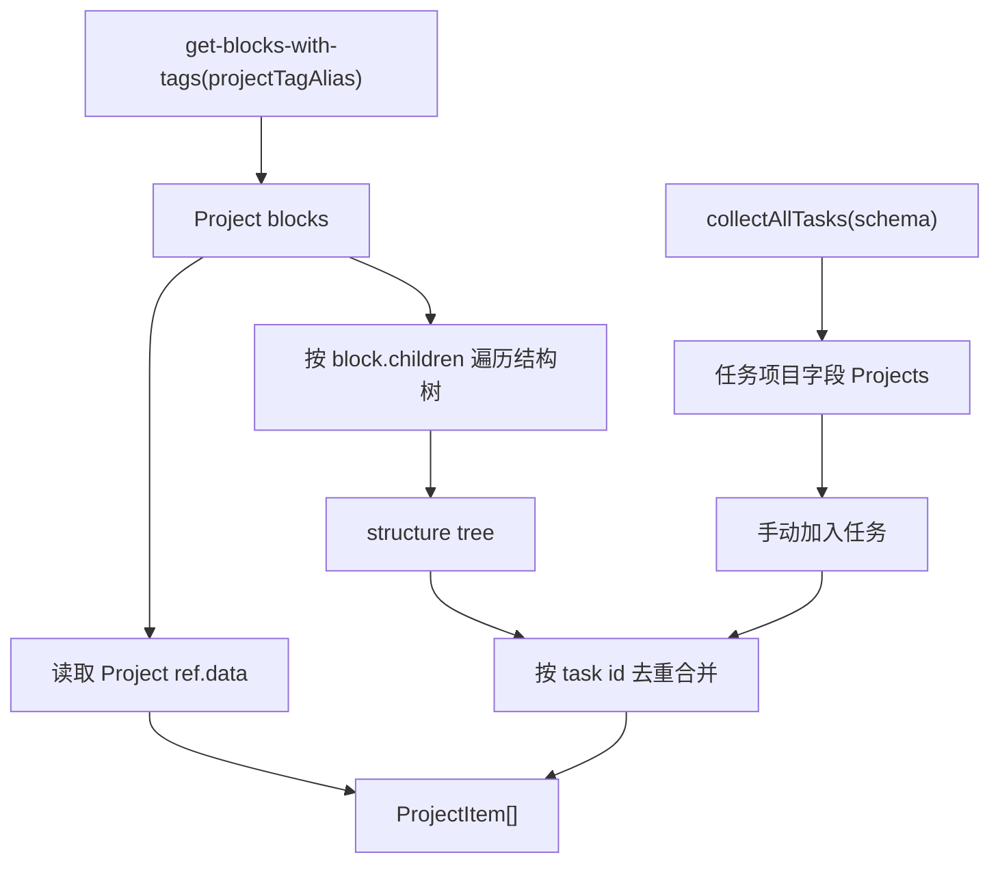

# 10. 项目数据流

## 相关源码

- `src/core/project-schema.ts`
- `src/core/project-properties.ts`
- `src/core/project-engine.ts`
- `src/core/project-popup-entry.ts`
- `src/ui/project-views-panel.tsx`
- `src/ui/task-property-panel.tsx`
- `src/core/task-block-menu.tsx`
- `src/core/task-schema.ts`

## 项目身份

项目由独立标签 `Project` 标记，默认 alias 为 `Project`，可通过设置 `projectTagName` 修改。

项目优先于任务：同一个 block 即使同时带 `Task` 和 `Project` 标签，也按项目处理，不进入普通任务、激活任务、My Day 或计时器候选。

`Project` 标签还提供项目级属性：

- `项目状态`：未开始、进行中、已暂停、已完成。
- `项目开始时间`、`项目截止时间`。
- `项目标签`、`项目备注`。

这些属性写在项目标签引用的 `ref.data` 中，由 `project-properties.ts` 解析和保存。项目状态是手动维护字段，不会随子任务完成自动推进。

项目标签字段会同步 Orca Note 标签体系：项目属性弹窗打开时，会读取项目 block 上除 `Project` 身份标签以外的其他 Orca 标签，并合并到 `项目标签` 字段；保存时也会把合并后的标签补入 Project 标签 schema 的 choices，方便后续项目复用。

## 项目读取总图

## 进度口径

- 总数 = 结构任务 + 手动加入任务及其任务子孙的并集。
- 已完成数 = 总数中状态为已完成的任务数。
- 已取消任务保留在总数中，不会推进完成进度。

## 结构归属与手动归属

1. 结构归属来自项目 block 的子孙树。
2. 手动归属来自任务标签 `ref.data` 中的 `Projects` 字段。
3. 手动归属是附加关系，不覆盖结构归属。
4. 同一项目内按 task id 去重后再统计进度。

## 项目面板

`ProjectViewsPanel` 负责展示项目列表、单项目进度和项目任务列表。

- 左侧显示项目列表和进度条。
- 右侧显示选中项目的项目属性摘要、进度和统一项目任务列表。
- “编辑项目”会打开项目属性弹窗，保存项目状态、开始/截止时间、项目标签和备注。
- “新增任务”会在当前项目 block 下创建普通任务子块。
- “添加已有任务”会打开任务选择弹窗，把选中的既有任务写入 `Projects` 字段。

## 项目标签点击入口

`project-popup-entry.ts` 注册项目标签 click 捕获、tag menu 命令和普通命令。用户在笔记中点击 `Project` 标签时，会打开项目属性弹窗；弹窗先通过 `collectProjectDatasetSnapshot()` 读取当前项目的动态进度，再复用项目属性编辑组件展示完成率、任务数、手动加入数，并保存项目标签 `ref.data`。

## Orca API 操作标注

| 操作类型 | API/命令 | 使用场景 | 耗时/影响标注 |
| --- | --- | --- | --- |
| 批量查询 | `orca.invokeBackend("get-blocks-with-tags", [projectTagAlias])` | 读取全部项目 block | 高：项目数量多时会产生明显扫描成本。 |
| 批量查询 | `orca.invokeBackend("get-blocks-with-tags", [taskTagAlias])` | 读取全部任务，再抽取项目字段 | 高：项目 tab 会复用任务全集扫描。 |
| 递归补充查询 | `orca.invokeBackend("get-block", blockId)` | 结构树回溯与 block 缓存兜底 | 中到高：树越深，兜底查询越多。 |
| 批量新增 | `core.editor.insertBlock` | 项目下新增任务 | 中：写入真实文档结构。 |
| 批量修改 | `core.editor.setRefData` / `core.editor.insertTag` | 手动加入项目、维护项目属性 | 中：手动加入会写任务标签 ref.data；项目属性会写项目标签 ref.data。 |
| UI 注册 | `orca.tagMenuCommands.registerTagMenuCommand` / `orca.commands.registerCommand` | 项目标签菜单与命令面板入口 | 低：生命周期注册，卸载时清理。 |
