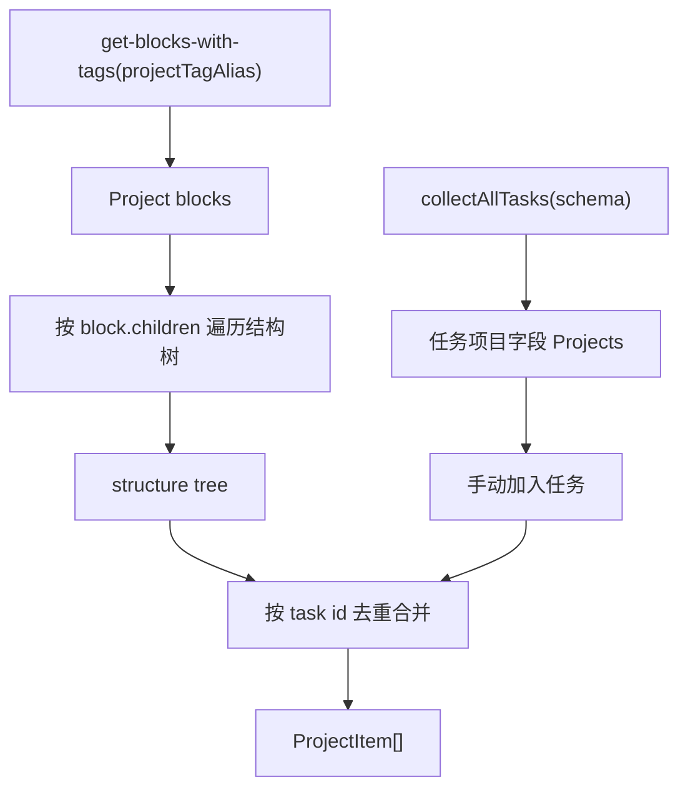

# 10. 项目数据流

## 相关源码

- `src/core/project-schema.ts`
- `src/core/project-engine.ts`
- `src/ui/project-views-panel.tsx`
- `src/ui/task-property-panel.tsx`
- `src/core/task-block-menu.tsx`
- `src/core/task-schema.ts`

## 项目身份

项目由独立标签 `Project` 标记，默认 alias 为 `Project`，可通过设置 `projectTagName` 修改。

项目优先于任务：同一个 block 即使同时带 `Task` 和 `Project` 标签，也按项目处理，不进入普通任务、激活任务、My Day 或计时器候选。

## 项目读取总图

## 进度口径

- 总数 = 结构任务 + 手动加入任务及其任务子孙的并集。
- 已完成数 = 总数中状态为已完成的任务数。
- 已取消任务保留在总数中，不会推进完成进度。

## 结构归属与手动归属

1. 结构归属来自项目 block 的子孙树。
2. 手动归属来自任务标签 `ref.data` 中的 `Projects` 字段。
3. 手动归属是附加关系，不覆盖结构归属。
4. 同一项目内按 task id 去重后再统计进度。

## 项目面板

`ProjectViewsPanel` 负责展示项目列表、单项目进度、结构任务树和手动加入任务区。

- 左侧显示项目列表和进度条。
- 右侧显示选中项目的结构树。
- “新增任务”会在当前项目 block 下创建普通任务子块。
- “手动加入任务”会把选中的任务写入 `Projects` 字段。

## Orca API 操作标注

| 操作类型 | API/命令 | 使用场景 | 耗时/影响标注 |
| --- | --- | --- | --- |
| 批量查询 | `orca.invokeBackend("get-blocks-with-tags", [projectTagAlias])` | 读取全部项目 block | 高：项目数量多时会产生明显扫描成本。 |
| 批量查询 | `orca.invokeBackend("get-blocks-with-tags", [taskTagAlias])` | 读取全部任务，再抽取项目字段 | 高：项目 tab 会复用任务全集扫描。 |
| 递归补充查询 | `orca.invokeBackend("get-block", blockId)` | 结构树回溯与 block 缓存兜底 | 中到高：树越深，兜底查询越多。 |
| 批量新增 | `core.editor.insertBlock` | 项目下新增任务 | 中：写入真实文档结构。 |
| 批量修改 | `core.editor.setRefData` / `core.editor.insertTag` | 手动加入项目、维护项目字段 | 中：会写任务标签 ref.data。 |

