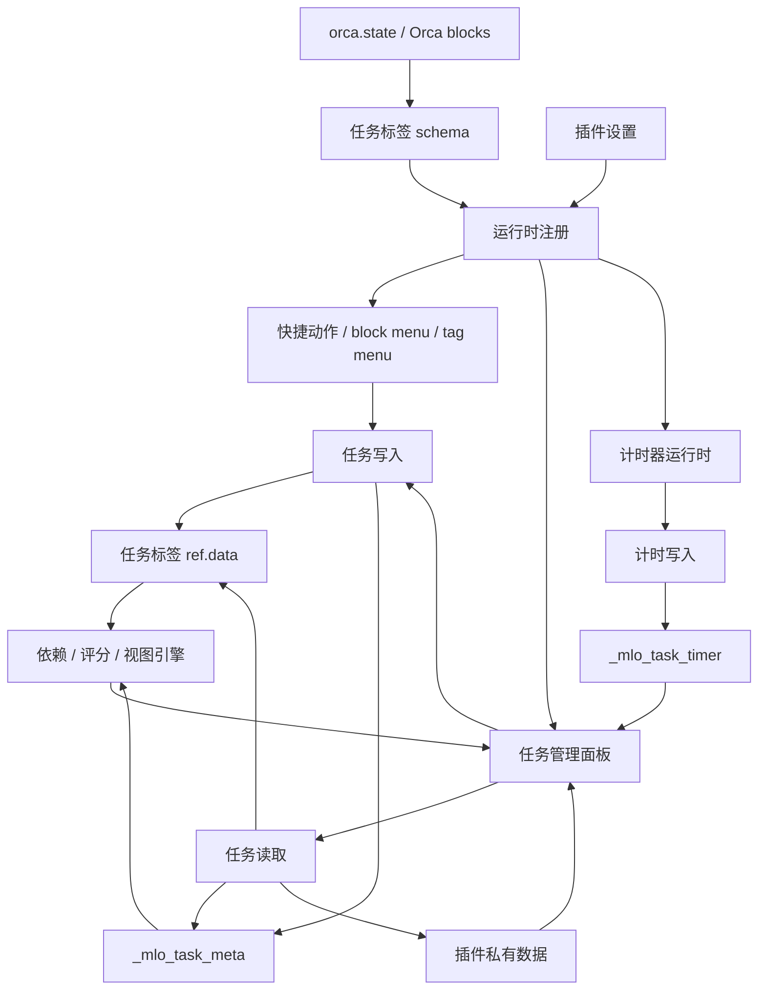

# Task Planner 架构与数据流文档索引

本目录用于沉淀 `orca-task-planner` 插件的模块边界、持久化数据结构和业务数据流。文档按业务域拆分，避免把所有内容堆在一个总览文件里。

## 文档清单

| 文档 | 覆盖范围 |
| --- | --- |
| [01-运行时启动与注册.md](./01-运行时启动与注册.md) | 插件启动、设置同步、任务标签 schema 初始化、运行时模块注册与卸载。 |
| [02-数据模型与存储.md](./02-数据模型与存储.md) | 任务标签 schema、`ref.data`、`_mlo_task_meta`、`_mlo_task_timer`、插件私有数据。 |
| [03-任务生命周期数据流.md](./03-任务生命周期数据流.md) | 任务创建、属性编辑、状态循环、删除、移动、子任务和父任务链接。 |
| [04-查询与视图数据流.md](./04-查询与视图数据流.md) | 全部任务读取、任务树、任务管理面板、仪表盘、收藏、即将到期、回顾和筛选视图。 |
| [05-依赖与评分数据流.md](./05-依赖与评分数据流.md) | 激活任务计算、依赖判定、顺序子任务、循环依赖、评分与排序。 |
| [06-我的一天数据流.md](./06-我的一天数据流.md) | My Day 私有状态、跨日重置、今日日志镜像/引用块同步、日程排期。 |
| [07-任务计时器数据流.md](./07-任务计时器数据流.md) | 任务计时数据、直接计时、番茄钟、全局计时器、行内控件、状态联动。 |
| [08-回顾与重复任务数据流.md](./08-回顾与重复任务数据流.md) | 回顾规则、标记已回顾、重复规则、完成后推进下一周期。 |
| [09-自定义视图与筛选数据流.md](./09-自定义视图与筛选数据流.md) | 自定义视图持久化、筛选树、字段发现和匹配流程。 |

## 总体数据流

## Orca 官方 API 热点总览

当前代码没有直接调用 `orca.invokeBackend("query", ...)` 通用查询 API；任务查询主要通过 `get-blocks-with-tags` 这种“按条件返回多条数据”的后端批量查询完成，再在前端构建任务树、依赖图、筛选结果和仪表盘数据。需要重点标注的不是单个轻量 API，而是下面这些“批量型操作”：

| 操作类型 | API/命令 | 使用场景 | 耗时/影响标注 |
| --- | --- | --- | --- |
| 批量查询 | `orca.invokeBackend("get-blocks-with-tags", [tagAlias])` | 全部任务、激活任务、计时器全局扫描、删除依赖清理 | 高：按任务标签查询多条任务数据，任务多时是主要耗时来源。 |
| 条件查询 | 未来可能的 `orca.invokeBackend("query", queryDescription)` | 当前未使用；若后续改用 Orca query API 查询任务集合或筛选视图 | 高：需要标注查询条件、返回规模、分页/缓存策略和触发频率。 |
| 递归补充查询 | `orca.invokeBackend("get-block", blockId)` 循环调用 | 解析父链、镜像块、My Day 日志树、可写目标兜底 | 中到高：单次不重，但在递归树遍历、批量候选解析中会累积耗时。 |
| 批量修改 | `core.editor.setRefData` / `core.editor.setProperties` 循环调用 | 重复任务推进、批量回顾、计时 checkpoint、依赖清理 | 高：单次修改不一定重，但批量循环写入会影响响应和撤销历史。 |
| 批量新增 | `core.editor.insertBlock` / `core.editor.insertTag` 多次调用 | 批量创建子任务、My Day 镜像/引用块兜底插入、重复任务子任务重开 | 中到高：会增加文档结构和引用数据。 |
| 批量删除 | `core.editor.deleteBlocks` | 删除任务块及后代、清理 My Day 重复镜像块 | 高影响：会删除文档结构，需先确认范围并清理依赖。 |
| 批量移动 | `core.editor.moveBlocks` | 任务树拖拽、多块移动、移动到今日日志 | 高影响：改变文档树结构，需防止移动到自身/后代。 |
| 插件数据读写 | `orca.plugins.getData/setData` | My Day、自定义视图持久化 | 低到中：数据量通常小；My Day 串行队列中会较频繁。 |

性能阅读建议：

- 查任务列表、激活任务、仪表盘、计时器候选时，优先看 [04-查询与视图数据流.md](./04-查询与视图数据流.md)、[05-依赖与评分数据流.md](./05-依赖与评分数据流.md)、[07-任务计时器数据流.md](./07-任务计时器数据流.md)。
- 查会写 Orca 文档结构的操作时，优先看 [03-任务生命周期数据流.md](./03-任务生命周期数据流.md)、[06-我的一天数据流.md](./06-我的一天数据流.md)。
- 若未来改为使用 `orca.invokeBackend("query", ...)`，应在对应文档中标注它属于“批量条件查询”，并写清 query 条件、预估返回规模、分页/缓存策略和触发频率。

## 阅读建议

1. 先读 [01-运行时启动与注册.md](./01-运行时启动与注册.md)，理解插件如何进入 Orca 运行时。
2. 再读 [02-数据模型与存储.md](./02-数据模型与存储.md)，明确数据分别存在哪里。
3. 开发具体功能时，按业务域进入对应数据流文档。
4. 修改 Orca 集成相关能力时，同时查 `vendor/orca-plugin-template/plugin-docs/` 中的本地 API 文档。
